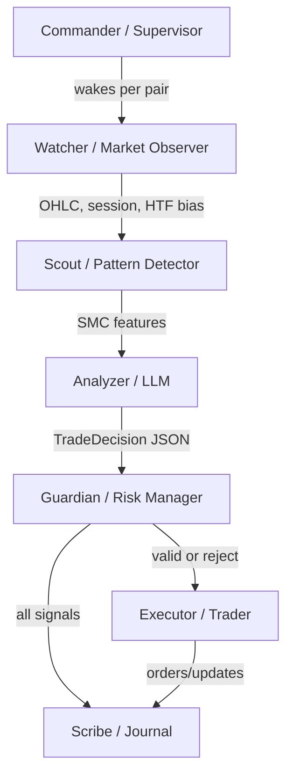
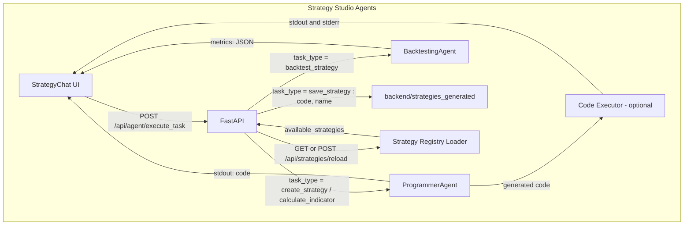

# Architecture

This document provides a detailed overview of the system architecture, including the frontend, backend, and agent-based trading system.

## System Overview

- **Backend (FastAPI, container llm-smc):**
  - cTrader TCP client background thread (`backend/ctrader_client.py`) for symbols, OHLC, orders.
  - LLM analyzer (`backend/llm_analyzer.py`) via Ollama; text-only SMC prompt flow by default.
  - Strategies registry (`backend/strategy.py`): `smc` (LLM), `rsi` (rule-based).
  - Agent controller (`backend/agent_controller.py`) and loop (`backend/agents/runner.py`).
  - Agent state persistence for signals and task status (`backend/agent_state.py`).
  - Trade journaling to SQLite (`backend/journal`).
- **Frontend (React 18 + Vite + NGINX):** charts, agent controls, journal, chat.
- **Ollama:** local LLM server (`ollama` container) accessible by backend at `http://ollama:11434`.

## Modern Frontend (React + Vite + NGINX)

The frontend is a modern React 18 + TypeScript single-page app built with Vite and served by NGINX inside the `frontend` container. All API requests under `/api/*` are proxied to the backend (`llm-smc:4000`) via `frontend/nginx.conf`.

Key notes:
- **React + Vite:** fast local reloads and production build packaged into NGINX.
- **API proxy:** `location /api { proxy_pass http://llm-smc:4000; }` keeps URLs same across dev/prod.
- **Status polling:** the dashboard polls `/api/agent/status` and other endpoints every few seconds to keep the UI live.

### Watch current button:
- The header includes a "Watch current" button that adds the currently selected symbol:timeframe to the agent watchlist.
- **Frontend wiring:**
  - `frontend/src/services/api.ts`: `addToWatchlist(symbol,timeframe)` POSTs to `/api/agent/watchlist/add?symbol=...&timeframe=...`.
  - `frontend/src/App.tsx`: `handleWatchCurrent` calls `addToWatchlist(...)` then refreshes `/api/agent/status`.
- **Backend** accepts query params and normalizes entries (uppercase, discards empties) before persisting.

### Toggle agent button:
- The "Start/Stop Agent" toggle sends only the server-supported fields to `/api/agent/config` and refreshes status upon success.

### Rebuild reminder:
- After frontend or backend changes, rebuild containers to ensure the UI and API are in sync:
  - `docker compose down`
  - `docker compose build --no-cache`
  - `docker compose up -d`

## Key Agents

- **Watcher/Observer:** fetches fresh OHLC for each (symbol,timeframe) in the watchlist.
- **Scout/Pattern Detector:** computes SMC features and builds prompt inputs.
- **Analyzer:** queries the LLM and parses a structured `TradeDecision`.
- **Guardian/Risk:** enforces confidence thresholds and prepares SL/TP.
- **Executor/Trader:** places, amends, or closes orders when `autotrade` is ON (live mode only).
- **Scribe/Journal:** records signals and executed trades.
- **Commander/Supervisor:** manages watchlist, starts/stops loops per pair.

## Agent Loop

Loop per watchlist pair:
- Wait until cTrader is connected and the symbol is available.
- Fetch recent OHLC; compute last bar close; skip until a new bar appears.
- Run strategy to get signal, confidence, and optional SL/TP.
- Emit a signal and update task status (`/api/agent/signals` and `/api/agent/status`).
- If `autotrade`+`live` and `confidence >= threshold`, submit orders and journal trades.

## Agents Workflow (Trading)

Roles and responsibilities:
- Watcher: fetch OHLC/session/HTF bias (cTrader client)
- Scout: compute SMC features/indicators (smc_features, indicators)
- Analyzer: produce TradeDecision JSON via Ollama (llm_analyzer)
- Guardian: confidence thresholds, SL/TP checks, gating rules
- Executor: order placement/amend/close (cTrader OpenAPI)
- Scribe: persist signals/trades (SQLite journal)
- Commander: schedules and watchlist orchestration

## Strategy Studio Agents

Notes:
- ProgrammerAgent: generates indicators/strategies from prompts; returns code and can save to disk.
- BacktestingAgent: runs compact backtests (optionally vectorbt) and returns metrics JSON.
- Strategy Registry Loader: scans `backend/strategies_generated`, registers `signals(df, ...)` for use in UI and agents.
