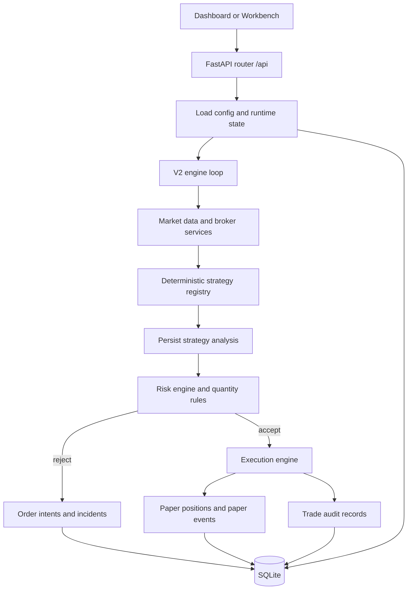
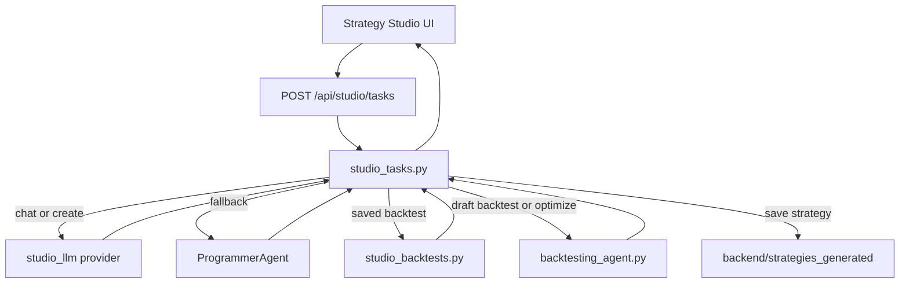
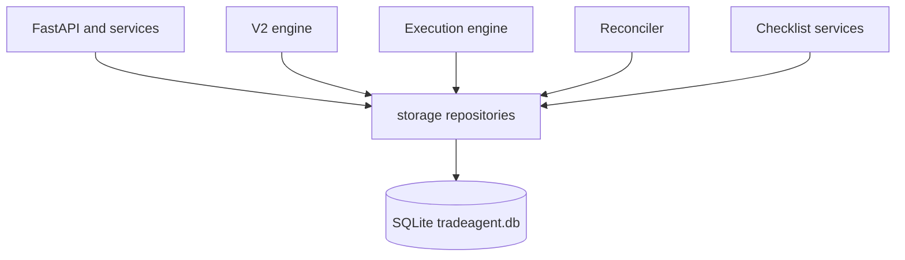

# Architecture

This document is the technical source of truth for the current TradeAgent implementation.

It reflects the active consolidated stack in `backend/` and `frontend/`. Older agent-controller and `/api/agent/*` documentation is legacy and should not be used to understand the current runtime.

## System Overview

TradeAgent has two core execution surfaces:

- Runtime trading engine:
  a consolidated paper-trading loop that scans a watchlist, analyzes deterministic strategies, runs risk checks, and persists intents, paper positions, and audit history.
- Strategy Studio:
  an LLM-assisted research workflow for drafting strategy code, backtesting drafts or saved files, and saving strategies under `backend/strategies_generated/`.

The system is best described as an agent-inspired, service-oriented architecture. The agent roles still make sense conceptually, but the implementation is consolidated into a smaller number of services rather than a swarm of independently deployed worker processes.

## Active Repo Shape

### Backend

- `backend/app.py`
  FastAPI entrypoint
- `backend/app_bootstrap.py`
  startup wiring, dependency warmup, generated-strategy loading, engine lifecycle
- `backend/api/router.py`
  active `/api/*` surface
- `backend/services/engine.py`
  background V2 paper-trading loop
- `backend/services/risk_engine.py`
  runtime trade acceptance and rejection logic
- `backend/services/execution_engine.py`
  order-intent creation, paper position open/update/flip flow
- `backend/services/reconciler.py`
  startup and manual recovery/reconciliation
- `backend/services/studio_tasks.py`
  Strategy Studio task router
- `backend/services/studio_backtests.py`
  backtesting for saved and draft strategy files
- `backend/storage/`
  SQLite-backed persistence
- `backend/strategies/`
  deterministic runtime strategies used by the V2 engine
- `backend/strategies_generated/`
  saved Strategy Studio strategy files

### Frontend

- `frontend/src/pages/DashboardPage.tsx`
  execution-facing dashboard
- `frontend/src/pages/Workbench.tsx`
  operator control surface
- `frontend/src/pages/StrategyStudio/`
  chat, drafting, and result workflow
- `frontend/src/pages/HeavyweightChecklist.tsx`
  structured operator checklist

## Multi-Agent Model

### What "agent" means in the current repo

There are two valid ways to describe the system:

- Conceptual agent roles:
  market observer, strategy analyst, risk guardian, executor, audit memory, and research assistant
- Actual software implementation:
  one orchestrated runtime engine plus supporting services, and one separate Strategy Studio task pipeline

That distinction matters. In the current codebase, the runtime engine is not a set of separate long-lived micro-agents communicating over queues. It is a coordinated service loop with clearly separated responsibilities and persistent operator-facing state.

### Runtime agent-role mapping

- Coordinator:
  `backend/services/engine.py`
- Market observer:
  `backend/services/market_data.py`, broker adapters, and symbol/bar retrieval
- Strategy analyst:
  `backend/strategies/registry.py` and deterministic strategy implementations
- Risk guardian:
  `backend/services/risk_engine.py` and `backend/services/quantity_rules.py`
- Executor:
  `backend/services/execution_engine.py`
- Recovery and reconciliation:
  `backend/services/reconciler.py`
- Memory and audit:
  `backend/storage/repositories.py` backed by SQLite

### Strategy Studio agent-role mapping

- Task router:
  `backend/services/studio_tasks.py`
- LLM interface:
  `backend/services/studio_llm.py`
- Fallback code generator:
  `backend/programmer_agent.py`
- Backtest engine:
  `backend/backtesting_agent.py`
- Saved strategy backtests:
  `backend/services/studio_backtests.py`
- Generated strategy loader:
  `backend/strategy.py` on startup for saved strategy modules

## Runtime Trading Flow

The runtime flow is paper-first and operator-controlled.

1. The app boots through FastAPI and `app_bootstrap.py`.
2. Broker transport and model warmup may be started depending on environment flags.
3. Generated strategies are loaded for research tooling.
4. The V2 engine starts and enters its background loop.
5. On each cycle, the engine loads config and the active watchlist.
6. For each enabled watchlist item, it fetches fresh bars and skips unchanged bars.
7. It runs the selected deterministic strategy.
8. The resulting analysis is persisted.
9. Risk and quantity checks decide whether to reject, update, flip, or open a paper position.
10. Intents, incidents, events, positions, and trade audit records are persisted for the UI.

### Runtime flow diagram

### Runtime implementation notes

- The active runtime strategy registry is `backend/strategies/registry.py`.
- The deterministic runtime strategies are currently:
  - `sma_cross`
  - `rsi_reversal`
  - `breakout`
- Generated strategies are useful in Strategy Studio research, but autonomous paper execution is built around the deterministic runtime path.
- Live execution remains intentionally disabled even if a config flag requests it.

## Strategy Studio Flow

Strategy Studio is separate from the paper-trading loop. It is a research workflow, not the autonomous execution path.

1. The frontend sends a studio task to `/api/studio/tasks`.
2. `studio_tasks.py` normalizes the task type and routes it.
3. For chat or code generation:
   - it uses the configured LLM provider and model when available
   - it falls back to `ProgrammerAgent` if code generation fails or times out
4. For backtests:
   - saved strategies can be backtested from disk
   - draft code can be backtested directly without saving
5. For save actions:
   - code is written to `backend/strategies_generated/`
   - generated strategy modules can be loaded on startup for research access

### Strategy Studio flow diagram

### Strategy Studio boundaries

- It is a research tool, not the live runtime engine.
- Saved strategy files are not the same thing as the deterministic runtime strategy registry.
- Some compatibility code still exists around `backend/strategy.py` and older generated-strategy paths, but that is not the main autonomous runtime path.

## Persistence Model

SQLite is the system memory layer for the operator-facing product.

Persisted entities include:

- engine config
- engine runtime state
- incidents
- analyses
- paper positions
- paper events
- order intents
- trade audit records
- cached market bars

### Persistence diagram

## API Boundaries

All active public routes are under `/api`.

Main groups:

- health and status
- operator config
- market data and symbol metadata
- analysis and manual orders
- engine control and recovery
- paper trade history
- checklist and calendar support
- Strategy Studio routes

The older `/api/agent/*` routes referenced by historical docs are not the active surface anymore.

## Frontend Surface

The frontend exposes four major product surfaces:

- `/`
  dashboard
- `/workbench`
  operator controls and paper-engine observability
- `/strategy-studio`
  strategy drafting and backtesting
- `/heavyweight-checklist`
  structured execution checklist

The dashboard is optimized for execution context, while the workbench exposes the full control plane.

## Active Boundaries And Safety

- autonomous execution is paper-only
- live mode requests are persisted but not honored by an active live execution engine
- the runtime is intentionally guarded by confidence thresholds, bar freshness checks, protective-level validation, sizing rules, cooldowns, max trade counts, position limits, and daily loss controls

This is a deliberate product boundary. The repo is built to demonstrate disciplined AI-assisted trading tooling and execution control, not unsafe fully autonomous live trading.

## Legacy Notes

The repo still contains some compatibility and historical files:

- `backend/agent_state.py`
- `backend/llm_analyzer.py`
- `backend/strategy.py`

These are not proof that the old architecture document is still correct. The authoritative current runtime is the consolidated stack described above.

If documentation and code disagree, trust:

1. `backend/api/router.py`
2. `backend/services/engine.py`
3. `backend/services/studio_tasks.py`
4. the current frontend pages and `frontend/src/services/api.ts`

## Related Docs

- [README.md](README.md)
- [docs/operations/local-run.md](docs/operations/local-run.md)
