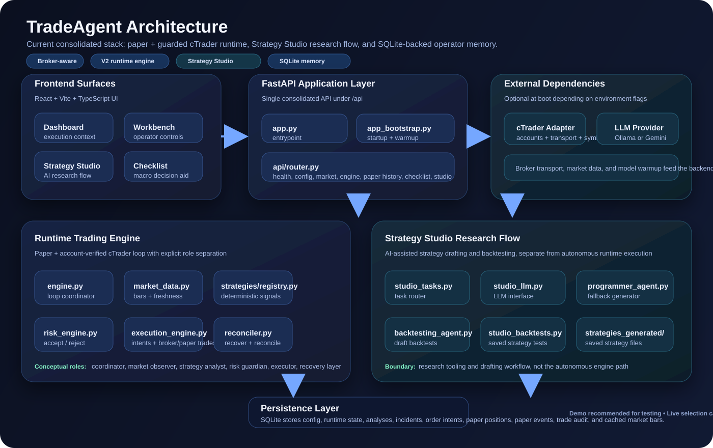
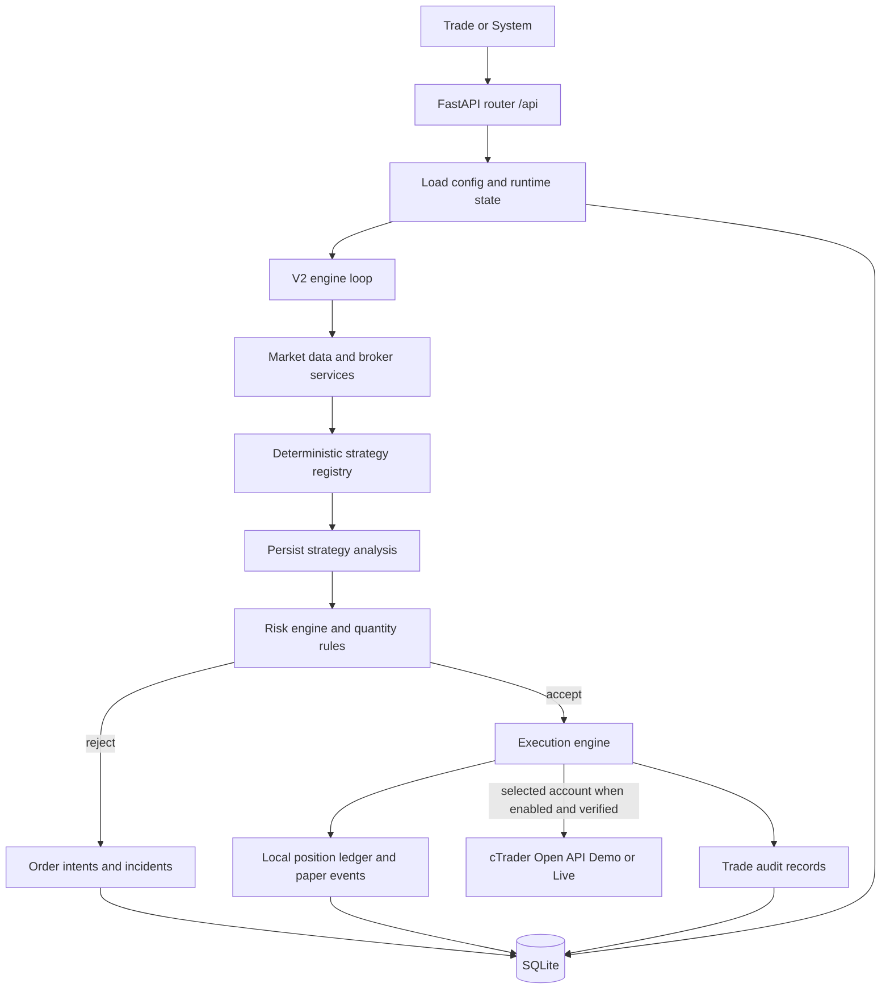
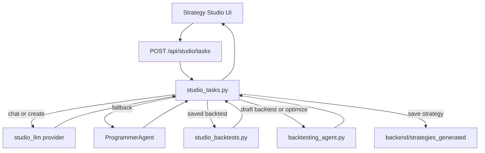
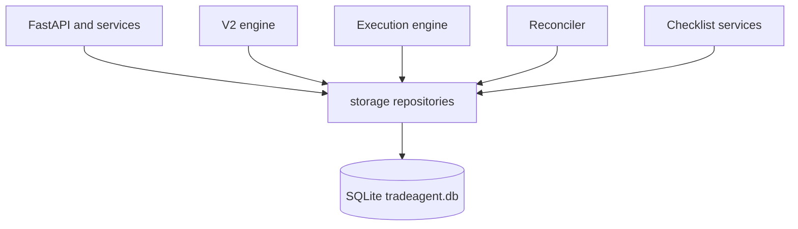

# Architecture

This document is the technical source of truth for the current TradeAgent implementation.

It reflects the active consolidated stack in `backend/` and `frontend/`. Older agent-controller and `/api/agent/*` documentation is legacy and should not be used to understand the current runtime.

## System Overview

TradeAgent has two core execution surfaces:

- Runtime trading engine:
  a consolidated deterministic trading loop that scans a watchlist, analyzes trusted runtime strategies, runs risk checks, persists the local position/audit ledger, and can optionally route accepted orders to the explicitly selected authenticated cTrader Demo or Live account after the same broker-readiness and safety checks pass.
- Strategy Studio:
  an LLM-assisted research workflow for drafting strategy code, backtesting drafts or saved files, and saving strategies under `backend/strategies_generated/`.

The system is best described as an agent-inspired, service-oriented architecture. The agent roles still make sense conceptually, but the implementation is consolidated into a smaller number of services rather than a swarm of independently deployed worker processes.

## Active Repo Shape

### Backend

- `backend/app.py`
  FastAPI entrypoint
- `backend/app_bootstrap.py`
  startup wiring, dependency warmup, generated-strategy compatibility validation, engine lifecycle
- `backend/api/router.py`
  active `/api/*` surface
- `backend/services/engine.py`
  background V2 trading loop with local paper state and guarded account-neutral cTrader routing
- `backend/services/risk_engine.py`
  runtime trade acceptance and rejection logic
- `backend/services/execution_engine.py`
  order-intent creation, local position open/update/flip flow, and guarded cTrader execution handoff
- `backend/services/reconciler.py`
  startup and manual recovery/reconciliation
- `backend/services/studio_tasks.py`
  Strategy Studio task router
- `backend/services/studio_backtests.py`
  backtesting for saved and draft strategy files
- `backend/storage/`
  SQLite-backed persistence
- `backend/strategies/`
  deterministic runtime strategies used by the V2 engine
- `backend/strategies_generated/`
  saved Strategy Studio strategy files

### Frontend

- `frontend/src/pages/DashboardPage.tsx`
  Trade workspace
- `frontend/src/pages/BuildTestPage.tsx`
  strategy research, validation, and lifecycle workspace
- `frontend/src/pages/SystemPage.tsx`
  runtime health, safety configuration, recovery, and audit
- `frontend/src/pages/StrategyStudio/`
  underlying chat, drafting, and result components used by Build & Test

## Multi-Agent Model

### What "agent" means in the current repo

There are two valid ways to describe the system:

- Conceptual agent roles:
  market observer, strategy analyst, risk guardian, executor, audit memory, and research assistant
- Actual software implementation:
  one orchestrated runtime engine plus supporting services, and one separate Strategy Studio task pipeline

That distinction matters. In the current codebase, the runtime engine is not a set of separate long-lived micro-agents communicating over queues. It is a coordinated service loop with clearly separated responsibilities and persistent operator-facing state.

### Runtime agent-role mapping

- Coordinator:
  `backend/services/engine.py`
- Market observer:
  `backend/services/market_data.py`, broker adapters, and symbol/bar retrieval
- Strategy analyst:
  `backend/strategies/registry.py` and deterministic strategy implementations
- Risk guardian:
  `backend/services/risk_engine.py` and `backend/services/quantity_rules.py`
- Executor:
  `backend/services/execution_engine.py`
- Recovery and reconciliation:
  `backend/services/reconciler.py`
- Memory and audit:
  `backend/storage/repositories.py` backed by SQLite

### Strategy Studio agent-role mapping

- Task router:
  `backend/services/studio_tasks.py`
- LLM interface:
  `backend/services/studio_llm.py`
- Fallback code generator:
  `backend/programmer_agent.py`
- Backtest engine:
  `backend/backtesting_agent.py`
- Saved strategy backtests:
  `backend/services/studio_backtests.py`
- Generated strategy compatibility validator:
  `backend/strategy.py` validates saved generated source on startup without importing or registering it into the trusted runtime

## Runtime Trading Flow

The runtime flow is paper-first, account-verified, and operator-controlled. Demo and Live are account types within the same cTrader execution architecture, not separate runtime products.

1. The app boots through FastAPI and `app_bootstrap.py`.
2. Broker transport and model warmup may be started depending on environment flags.
3. Saved generated-strategy files are compatibility-validated for research tooling without being imported or registered into the trusted runtime.
4. The V2 engine starts and enters its background loop.
5. On each cycle, the engine loads config and the active watchlist.
6. For each enabled watchlist item, it fetches fresh bars and skips unchanged bars.
7. It runs the selected deterministic strategy.
8. The resulting analysis is persisted.
9. Risk and quantity checks decide whether to reject, update, flip, or open local position state; when cTrader auto-trading is explicitly enabled and broker readiness is verified, execution may also route the accepted order to the selected authenticated Demo or Live account.
10. Intents, incidents, events, positions, and trade audit records are persisted for the UI.

### Runtime flow diagram

```mermaid
graph TD
  UI[Trade or System] --> API[FastAPI router /api]
  API --> CFG[Load config and runtime state]
  CFG --> ENG[V2 engine loop]
  ENG --> MD[Market data and broker services]
  MD --> STRAT[Deterministic strategy registry]
  STRAT --> ANALYSIS[Persist strategy analysis]
  ANALYSIS --> RISK[Risk engine and quantity rules]
  RISK -->|reject| INTENTS[Order intents and incidents]
  RISK -->|accept| EXEC[Execution engine]
  EXEC --> PAPER[Local position ledger and paper events]
  EXEC -->|selected account when enabled and verified| CTRADER[cTrader Open API Demo or Live]
  EXEC --> AUDIT[Trade audit records]
  INTENTS --> DB[(SQLite)]
  PAPER --> DB
  AUDIT --> DB
  CFG --> DB
```

### Runtime implementation notes

- The active runtime strategy registry is `backend/strategies/registry.py`.
- The deterministic runtime strategies are currently:
  - `sma_cross`
  - `rsi_reversal`
  - `breakout`
- Generated strategies are research artifacts and are not imported into the trusted runtime registry; autonomous execution remains built around the reviewed deterministic runtime path.
- cTrader discovers every account authorized by the configured access token and retains the broker-reported Demo/Live type.
- The System dashboard persists one selected account. Same-host account changes re-authenticate the existing client; Demo↔Live changes replace the cTrader client service while keeping the Twisted reactor alive.
- Execution fails closed while selected and active account state differ. Once the selected account is authenticated, the same account currency/equity, symbol metadata, risk/sizing, protection, position-limit, reconciliation, recovery, close-safety, and audit controls apply to Demo and Live.
- Demo is the recommended account type for development and testing. Selecting Live and enabling cTrader auto-trade can place real-money orders.

## Build & Test Research Flow

Strategy Studio is separate from the autonomous runtime trading loop. It is a research workflow, not the autonomous execution path.

1. The frontend sends a studio task to `/api/studio/tasks`.
2. `studio_tasks.py` normalizes the task type and routes it.
3. For chat or code generation:
   - it uses the configured LLM provider and model when available
   - it falls back to `ProgrammerAgent` if code generation fails or times out
4. For backtests:
   - saved strategies can be backtested from disk
   - draft code can be backtested directly without saving
5. For save actions:
   - code is written to `backend/strategies_generated/`
   - startup compatibility validation may inspect that source, but it does not import or register generated modules into the trusted runtime

### Build & Test flow diagram

```mermaid
graph TD
  UI[Strategy Studio UI] --> API[POST /api/studio/tasks]
  API --> ROUTER[studio_tasks.py]
  ROUTER -->|chat or create| LLM[studio_llm provider]
  ROUTER -->|fallback| PA[ProgrammerAgent]
  ROUTER -->|saved backtest| SBA[studio_backtests.py]
  ROUTER -->|draft backtest or optimize| BA[backtesting_agent.py]
  ROUTER -->|save strategy| FS[backend/strategies_generated]
  LLM --> ROUTER
  PA --> ROUTER
  SBA --> ROUTER
  BA --> ROUTER
  ROUTER --> UI
```

### Build & Test boundaries

- It is a research tool, not the live runtime engine.
- Saved strategy files are not the same thing as the deterministic runtime strategy registry.
- Lifecycle promotion governs evidence and execution eligibility for a strategy identifier/version, but it does not import raw generated source into the trusted runtime registry.
- Some compatibility code still exists around `backend/strategy.py` and older generated-strategy paths, but current startup validation does not make those generated files executable.

## Persistence Model

SQLite is the system memory layer for the operator-facing product.

Persisted entities include:

- engine config
- engine runtime state
- incidents
- analyses
- paper positions
- paper events
- order intents
- trade audit records
- cached market bars

### Persistence diagram

```mermaid
graph TD
  API[FastAPI and services] --> REPO[storage repositories]
  ENG[V2 engine] --> REPO
  EXEC[Execution engine] --> REPO
  RECON[Reconciler] --> REPO
  CHECK[Checklist services] --> REPO
  REPO --> DB[(SQLite tradeagent.db)]
```

## API Boundaries

All active public routes are under `/api`.

Main groups:

- health and status
- operator config
- market data and symbol metadata
- analysis and manual orders
- engine control and recovery
- paper trade history
- calendar and market-event support
- Build & Test research routes

The older `/api/agent/*` routes referenced by historical docs are not the active surface anymore.

## Frontend Surface

The frontend exposes three connected product surfaces:

- `/`
  Trade: charting, selected-market context, signals, local paper orders plus guarded cTrader orders on the selected account, positions, and journal
- `/build-test`
  Build & Test: hypothesis, drafting, backtesting, evidence validation, and lifecycle promotion
- `/build-test/results`
  Build & Test results: persisted backtest/validation result review
- `/system`
  System: runtime health, safety controls, reconciliation, recovery, and audit

Market context is embedded in Trade. Calibration and shadow replay are research-only components inside Build & Test.

## Active Boundaries And Safety

- autonomous execution supports local paper positions and opt-in cTrader orders on the explicitly selected authenticated account
- the cTrader access token supplies the authorized account directory; operators do not configure one environment-variable block per account
- `CTRADER_HOST_TYPE` and `CTRADER_ACCOUNT_ID` are bootstrap/fallback configuration, while normal runtime selection is persisted through TradeAgent
- selected-versus-active account truth is explicit, and execution fails closed during incomplete account switching or missing broker readiness
- Demo and Live use the same guarded execution path: verified account currency/equity, symbol metadata, sizing/risk rules, protective stops, cooldowns, trade/position limits, daily-loss controls, reconciliation, recovery, close safety, and durable audit
- the kill switch and per-symbol trading enablement remain independent execution gates

Use Demo accounts for development, testing, and strategy validation. A selected Live account is not a simulation: if cTrader auto-trade and the symbol's auto-trade control are enabled and the kill switch/safety checks permit execution, TradeAgent can submit real-money orders. Operators remain responsible for broker permissions, account selection, configured risk, and live trading consequences.

## Legacy Notes

Historical planning documents retained for provenance:

- `IMPLEMENTATION_PLAN.md` — March 2026 Strategy Studio/backtesting upgrade plan; references retired `/api/agent/execute_task` validation and old local-drive paths.
- `STRATEGY_INTEGRATION_PLAN.md` — October 2025 standalone Strategy Studio integration plan; references retired `/strategy-studio` and `/api/agent/execute_task` surfaces.

Both files are explicitly historical and must not be used as current architecture or operational guidance.

The repo still contains some compatibility and historical files:

- `backend/agent_state.py`
- `backend/llm_analyzer.py`
- `backend/strategy.py`

These are not proof that the old architecture document is still correct. The authoritative current runtime is the consolidated stack described above.

If documentation and code disagree, trust:

1. `backend/api/router.py`
2. `backend/services/engine.py`
3. `backend/services/studio_tasks.py`
4. the current frontend pages and `frontend/src/services/api.ts`

## Related Docs

- [README.md](README.md)
- [docs/operations/local-run.md](docs/operations/local-run.md)
