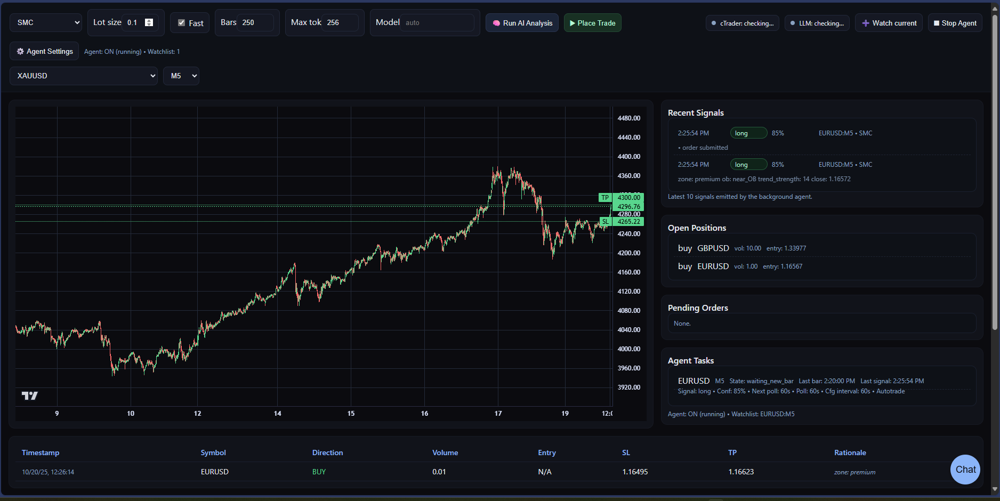
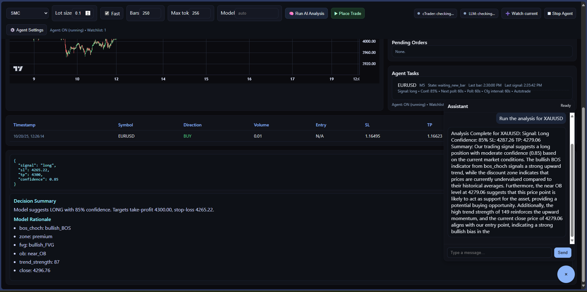

# 💹 GenAI-MultiAgent-TradingSystem

A full-stack, local-first trading platform that uses live cTrader market data and LLM analysis to produce structured trade decisions—and optionally executes them automatically using a multi-agent workflow.

> ⚡ Runs 100% locally with **Docker + Ollama** — **no OpenAI keys required**.

---

## 📚 Table of Contents

* [Highlights](#-highlights)
* [Demo Screens](#-demo-screens)
* [Architecture](#-architecture)
* [Repository Layout](#-repository-layout)
* [Quickstart](#-quickstart)
* [Configuration](#-configuration)
* [How It Works](#-how-it-works)
* [Agents](#-agents)
* [API (Selected Endpoints)](#-api-selected-endpoints)
* [UI Walkthrough](#-ui-walkthrough)
* [Performance & Model Tuning](#-performance--model-tuning)
* [Troubleshooting](#-troubleshooting)
* [Stability & Reliability](#-stability--reliability)
* [Roadmap](#-roadmap)
* [License](#-license)
* [Disclaimer](#-disclaimer)

---

## ✨ Highlights

* **Two ways to use it**
    * **Manual**: Pick a symbol/timeframe and click **Run AI Analysis** to get a structured trade idea from an LLM.
    * **Autonomous Agent**: Click **Start Agent** and let background agents monitor markets, emit **signals**, and (optionally) **trade automatically** using your risk settings.
* **LLM-based analysis**
    * Sends the latest OHLC rows and computed SMC features to your Ollama model.
    * Strict, machine-readable output:
        ```json
        {
          "signal": "long" | "short" | "no_trade",
          "sl": 3389.06,
          "tp": 3417.74,
          "confidence": 0.56,
          "reasons": ["plain English explanation"]
        }
        ```
* **Live trading integration (cTrader OpenAPI)**
    * Realtime candles, open positions & pending orders
    * Market & pending order placement with SL/TP amendment logic
    * **Paper** and **Live** modes
* **Multi-Agent workflow (production-style roles)**
    * **Watcher / Market Observer** – streams OHLC + session/HTF bias
    * **Scout / Pattern Detector** – detects SMC objects (CHOCH/BOS, FVG, OB, liquidity)
    * **Guardian / Risk Manager** – validates SL/TP & confidence thresholds
    * **Executor / Trader** – places/updates/closes trades (paper or live)
    * **Scribe / Journal Keeper** – records signals (optional Notion/DB hook)
    * **Commander / Supervisor** – orchestrates schedules & watchlists
```mermaid
graph TD
  subgraph "Autonomous Agent Workflow"
    A[Commander / Supervisor] -- "Starts Loop" --> B{For each pair in Watchlist}
    B --> C[Watcher]
    C -- "Fetches Market Data" --> D[Scout]
    D -- "Detects Patterns & Queries LLM" --> E[Guardian]
    E -- "All Signals" --> F(Scribe)
    F -- "Logs Signal" --> G((Signal Log))
    E -- "Signal is Valid" --> H(Executor)
    H -- "Autotrade is ON" --> I[cTrader API]
    H -- "Trade Executed" --> F
    F -- "Journals Trade" --> J((Trade Journal))
  end
````

  * **Hybrid Analysis Chatbot**
      * **Technical:** `get_price`, `run_analysis`, `place_order`
      * **Fundamental:** `news for [symbol/topic]` (e.g., "news on US inflation")
      * **Agent Control:** `start_agents`, `stop_agents`, `get_agent_status`
  * **Automatic Trade Journaling**
      * All executed trades (UI, Agent, or Chatbot) are logged to local **SQLite** (`data/journal.db`)
      * The dashboard provides a read-only, immutable **Trade Journal**
  * **Fast, modern frontend**
      * React 18 + TypeScript + Vite SPA, served by NGINX in the `frontend` container
      * Lightweight-Charts candles, overlays (SMA/EMA/VWAP/BB), SL/TP lines
      * Status chips for cTrader + LLM health; side panels for Signals, Positions & Orders

-----

## 📸 Demo Screens





-----

## 🏗️ Architecture

```
┌─────────────── UI (React + Vite + NGINX) ────────────────┐
│  Manual run & Agent control; Lightweight‑Charts + overlays│
└───────────────▲───────────────────────────────────────────┘
                │ HTTP (FastAPI) via /api proxy
                ▼
┌──────────── Backend (llm-smc) ────────────┐
│ - cTrader client (candles, positions)     │
│ - SMC feature extractor                   │
│ - Multi-agent runner + controller         │
│ - Order execution                         │
└───────────────▲───────────────┬───────────┘
                │               │
                │               ▼
                │        ┌──────────────┐
                │        │   Ollama     │  (e.g., llama3.2)
                │        └──────────────┘
                │
                ▼
       cTrader OpenAPI (live feed & orders)
```

-----

## 🗂 Repository Layout

```text
GenAI-MultiAgent-TradingSystem/
├─ backend/
│  ├─ agent_config.json
│  ├─ agent_controller.py
│  ├─ agent_state.py
│  ├─ app.py
│  ├─ ctrader_client.py
│  ├─ data_fetcher.py
│  ├─ indicators.py
│  ├─ llm_analyzer.py
│  ├─ prestart.py
│  ├─ smc_features.py
│  ├─ strategy.py
│  ├─ symbol_fetcher.py
│  ├─ web_search.py
│  ├─ agents/
│  │  └─ runner.py
│  ├─ chat/
│  │  ├─ manager.py
│  │  ├─ router.py
│  │  └─ service.py
│  ├─ journal/
│  │  ├─ db.py
│  │  └─ router.py
│  ├─ strategies_generated/
│  ├─ Dockerfile
│  ├─ .env.example
│  └─ __init__.py
├─ frontend/
│  ├─ Dockerfile
│  ├─ eslint.config.js
│  ├─ index.html
│  ├─ nginx.conf
│  ├─ package.json
│  ├─ tsconfig.json
│  ├─ vite.config.ts
│  ├─ public/
│  │  └─ vite.svg
│  └─ src/
│     ├─ App.tsx
│     ├─ components/
│     │  ├─ AgentSettings.tsx
│     │  ├─ AIOutput.tsx
│     │  ├─ Chart.tsx
│     │  ├─ Chat.tsx
│     │  ├─ Header.tsx
│     │  ├─ Journal.tsx
│     │  ├─ SidePanel.tsx
│     │  └─ SymbolSelector.tsx
│     ├─ services/
│     │  └─ api.ts
│     ├─ styles/
│     │  ├─ chat.css
│     │  └─ global.css
│     └─ types/
│        ├─ analysis.ts
│        └─ index.ts
├─ docs/
├─ docker-compose.yml
├─ docker_usage_guide.md
├─ requirements.txt
├─ package-lock.json
├─ start.sh
├─ NOTES.md
└─ README.md
```


-----

## 🚀 Quickstart

**1) Clone & configure**

```bash
git clone [https://github.com/maghdam/GenAI-MultiAgent-TradingSystem.git](https://github.com/maghdam/GenAI-MultiAgent-TradingSystem.git)
cd GenAI-MultiAgent-TradingSystem
```

Create `backend/.env`:

```ini
# ===== cTrader =====
CTRADER_CLIENT_ID=...
CTRADER_CLIENT_SECRET=...
CTRADER_HOST_TYPE=demo
CTRADER_ACCESS_TOKEN=...
CTRADER_ACCOUNT_ID=...

# ===== LLM =====
OLLAMA_URL=http://ollama:11434
OLLAMA_MODEL=llama3.2

# ===== Optional defaults =====
DEFAULT_SYMBOL=XAUUSD
```

**2) Bring up the stack**

```bash
docker compose up --build -d```

**3) Open the dashboard**

```
http://localhost:8080
```

  * Use **Run AI Analysis** for one-off insights
  * Use **Watch current** to add the current pair to the agent’s watchlist
  * Click **Start Agent** to begin the autonomous loop (adjust thresholds in **Agent Settings**)

> **Rebuild Reminder:** After frontend or backend changes, rebuild containers to keep UI & API in sync:
> `docker compose down && docker compose build --no-cache && docker compose up -d`

-----

## ⚙️ Configuration

### Backend environment (`backend/.env`)

| Key | Description |
| :--- | :--- |
| `CTRADER_CLIENT_ID` | cTrader client ID |
| `CTRADER_CLIENT_SECRET` | cTrader client secret |
| `CTRADER_HOST_TYPE` | `demo` or `live` |
| `CTRADER_ACCESS_TOKEN` | Auth token |
| `CTRADER_ACCOUNT_ID` | Account ID |
| `OLLAMA_URL` | e.g., `http://ollama:11434` |
| `OLLAMA_MODEL` | Default model, e.g., `llama3.2` |
| `DEFAULT_SYMBOL` | Optional initial chart symbol |

### Frontend → Backend proxy (NGINX)

All `/api/*` requests are proxied to the backend (`llm-smc:4000`) via `frontend/nginx.conf`:

```nginx
location /api {
  proxy_pass http://llm-smc:4000;
}
```

-----

## 💡 How It Works

  * **UI** requests `/api/candles` → **backend** fetches from cTrader → **UI** renders chart
  * **Manual**: **UI** posts to `/api/analyze` → **backend** gets SMC features → **Ollama** model → returns `{signal, sl, tp, confidence, reasons}`
  * **Agent**: `agents/runner.py` loops over watchlist on a schedule, repeats step 2, emits signals, and (if `autotrade=true` & `mode=live`) places/updates trades
  * **Chatbot**: `chat/service.py` parses intent and calls the relevant service (e.g., `place_order`) with a confirmation flow

-----

## 🧠 Agents

When **Start Agent** is ON, the supervisor wakes up every `interval_sec` and:

1.  Pulls fresh candles for each `(symbol, timeframe)` in **watchlist**
2.  Builds features and queries the LLM
3.  Emits a **signal** with a confidence score
4.  If `autotrade=true` and mode is **Live**, the **Executor** opens/closes positions according to thresholds and SL/TP rules

### Key agents & roles

  * **Watcher/Observer**: fetches OHLC for each watchlist pair
  * **Scout/Pattern Detector**: computes SMC features & prompt inputs
  * **Analyzer**: queries the LLM and parses a structured `TradeDecision`
  * **Guardian/Risk**: enforces confidence/SL/TP rules
  * **Executor/Trader**: places, amends, or closes orders when `autotrade` is ON (Live only)
  * **Scribe/Journal**: records signals and executed trades
  * **Commander/Supervisor**: manages watchlist; starts/stops loops per pair

-----

## 🔌 API (Selected Endpoints)

  * **Health & LLM**
      * `GET /api/health` → `{ status, connected }`
      * `GET /api/llm_status` → `{ ollama: 200|"unreachable", model }`
  * **Market Data**
      * `GET /api/symbols`
      * `GET /api/candles?symbol=EURUSD&timeframe=M15&indicators=SMA%20(20)&indicators=VWAP`
  * **Manual Analysis**
      * `POST /api/analyze` – optional overrides: `model`, `max_bars`, `max_tokens`, `options` (forwarded to Ollama)
  * **Trading**
      * `POST /api/execute_trade`
      * `GET /api/open_positions`
      * `GET /api/pending_orders`
  * **Agent Control**
      * `GET /api/agent/config`
      * `POST /api/agent/config` (toggle enabled, set interval/confidence/mode/autotrade/strategy)
      * `POST /api/agent/watchlist/add?symbol=XAUUSD&timeframe=H1`
      * `POST /api/agent/watchlist/remove?symbol=XAUUSD&timeframe=H1`
      * `GET /api/agent/signals?n=10`
      * `GET /api/agent/status`
  * **Journal**
      * `GET /api/journal/trades`
  * **Chat**
      * `POST /api/chat/stream` (streaming assistant)

-----

## 🖥️ UI Walkthrough

  * **Status chips**: cTrader connectivity + current LLM model
  * **Indicators**: add SMA/EMA/VWAP/BB to server-side candle fetch
  * **AI Output**: renders JSON decision + explanation
  * **SL/TP**: drawn on chart when provided
  * **Recent Signals**: latest agent outputs (click to preview on chart)
  * **Open Positions / Pending Orders**: live from cTrader
  * **AI Assistant**: chat widget (bottom-right) for conversational trading

### "Watch current"

  * Header button adds the current `symbol:timeframe` to the agent watchlist
  * **Frontend wiring**:
      * `frontend/src/services/api.ts` → `addToWatchlist(symbol, timeframe)` → `POST /api/agent/watchlist/add?symbol=...&timeframe=...`
      * `frontend/src/App.tsx` → `handleWatchCurrent` calls `addToWatchlist(...)` then refreshes `/api/agent/status`
  * Backend normalizes entries (uppercase, discards empties) before persisting

### "Start/Stop Agent"

  * Toggle sends supported fields to `/api/agent/config` and refreshes status upon success

-----

## 📈 Performance & Model Tuning

Global defaults (`backend/.env`):

```ini
OLLAMA_URL=http://ollama:11434
OLLAMA_MODEL=llama3.2
```

Per-request overrides (frontend → `/api/analyze`):

```json
{
  "symbol": "XAUUSD",
  "timeframe": "H1",
  "indicators": ["SMA (20)", "EMA (20)"],
  "model": "llama3.2",
  "max_bars": 200,
  "max_tokens": 256,
  "options": { "num_thread": 6 }
}
```

### Tips for CPU speed

  * Keep `llama3.2`
  * Use `max_bars` ≈ 150–250 and `max_tokens` ≈ 192–256
  * Ensure `OLLAMA_URL` points to your running Ollama service (docker-compose sets this)

-----

## 🧰 Troubleshooting

  * **LLM feels slow on CPU**
      * Use `llama3.2` and reduce `max_bars` / `max_tokens`
  * **Agent not trading**
      * Set **Mode=Live** and **Autotrade=On**; confirm cTrader connection and permissions
  * **No symbols**
      * Wait for cTrader to load or verify credentials in `.env`
  * **Watchlist & “Watch current”**
      * `POST /api/agent/watchlist/add?...` should return `{ ok: true }`
      * Confirm `/api/agent/status` shows the updated watchlist
      * After UI/API changes, **rebuild containers**
  * **If tasks don’t run:**
      * Ensure **Start Agent** is enabled
      * `/api/health` → `connected: true`
      * `/api/llm_status` indicates a reachable Ollama

-----

## 🔧 Stability & Reliability

Specific dependency versions are pinned to ensure stability. Recent updates resolved dependency conflicts (notably around `Twisted`) to provide reliable startup in Docker.


-----

## 🗺️ Roadmap

  * [x] **Fundamental Analysis:** Integrate news/event data into the chatbot
  * [ ] More strategies (MACD, Volume Profile, Order Flow)
  * [ ] Backtesting & walk-forward
  * [ ] Message-bus multi-agent comms + memory
  * [ ] Risk dashboard (exposure, VaR)
  * [ ] Cloud deploy templates (Render / Fly.io)
  * [ ] Add optional chart image analysis (vision model) for multimodal insights

-----

## 📜 License

This project is licensed under the MIT License - see the [LICENSE](LICENSE) file for details.

-----

## ⚠️ Disclaimer

This project is for **education and research**. It is **not financial advice**. Trading involves substantial risk. Do not use live trading with a real account before extensive testing on demo environments.

```
```