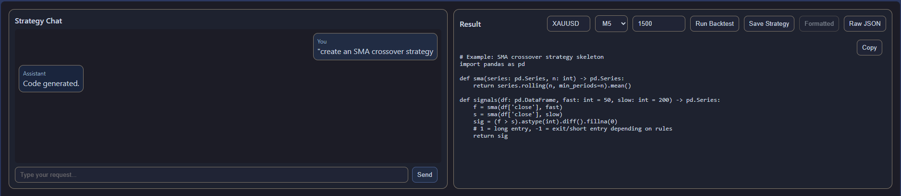
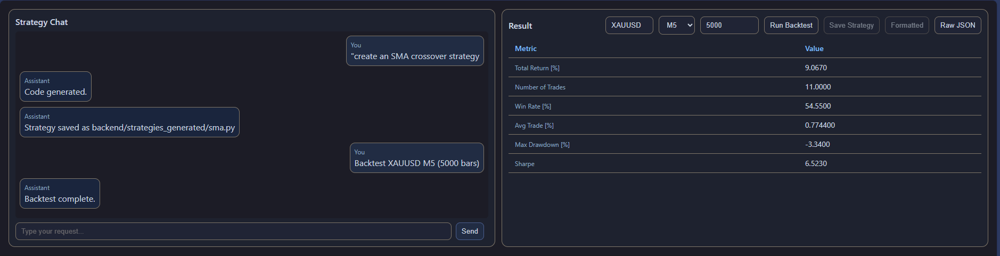
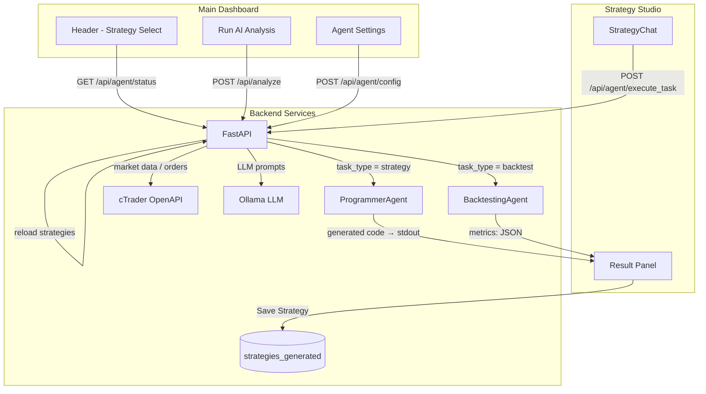

# GenAI-MultiAgent-TradingSystem

A local-first trading platform that uses live cTrader market data and LLM analysis to produce structured trade decisions, and can optionally execute them automatically via a multi-agent workflow.

> Runs 100% locally with Docker + Ollama. No OpenAI keys required.

---

## Table of Contents

- [Highlights](#highlights)
- [Demo Screens](#demo-screens)
- [Architecture](#architecture)
- [Repository Layout](#repository-layout)
- [Quickstart](#quickstart)
- [Configuration](#configuration)
- [How It Works](#how-it-works)
- [Agents](#agents)
- [API (Selected Endpoints)](#api-selected-endpoints)
- [Strategy Studio](#strategy-studio)
- [UI Walkthrough](#ui-walkthrough)
- [Performance & Model Tuning](#performance--model-tuning)
- [Troubleshooting](#troubleshooting)
- [Stability & Reliability](#stability--reliability)
- [Roadmap](#roadmap)
- [License](#license)
- [Disclaimer](#disclaimer)

---

## Highlights

- Two modes
  - Manual: Pick a symbol/timeframe and run AI analysis for a structured trade idea.
  - Autonomous Agent: Background agents monitor markets, emit signals, and can autotrade with your risk settings.
- LLM-based analysis
  - Sends latest OHLC rows + computed SMC features to your Ollama model.
  - Strict, machine-readable output:
    ```json
    {
      "signal": "long" | "short" | "no_trade",
      "sl": 3389.06,
      "tp": 3417.74,
      "confidence": 0.56,
      "reasons": ["plain English explanation"]
    }
    ```
- Live trading integration (cTrader OpenAPI)
  - Realtime candles, open positions & pending orders
  - Market & pending order placement with SL/TP amendment logic
  - Paper and Live modes
- Multi-agent workflow (production-style roles)
  - Watcher/Observer, Scout/Pattern Detector, Guardian/Risk, Executor/Trader, Scribe/Journal, Commander/Supervisor
- Strategy Studio (integrated)
  - Create strategies, generate code, run quick backtests, save to `backend/strategies_generated` and hot-reload.
- Automatic trade journaling
  - All executed trades (UI, Agent, or Chatbot) logged to local SQLite (`data/journal.db`).
- Fast, modern frontend
  - React 18 + TypeScript + Vite SPA served by NGINX. Lightweight-Charts with overlays (SMA/EMA/VWAP/BB), SL/TP lines, and health chips.

---

## Demo Screens





---

## Architecture




For a deeper dive into the system components and agent loop, see `ARCHITECTURE.md`.

---

## Repository Layout

- backend/
  - `app.py` – FastAPI app and routes (incl. strategies reload/list)
  - `strategy.py` – Base strategies (SMC, RSI) + loader for generated strategies
  - `programmer_agent.py` – Generates indicator/strategy code (Strategy Studio)
  - `backtesting_agent.py` – Quick backtests (SMA crossover; optional vectorbt)
  - `strategies_generated/` - Saved strategies (auto-loaded)
  - `llm_analyzer.py` – LLM orchestration for analysis
  - `ctrader_client.py` – cTrader OpenAPI integration
  - `journal/` – Trade journaling API + DB
  - `agents/` – Autonomous agent runner (optional)
  - plus helpers: `data_fetcher.py`, `indicators.py`, `smc_features.py`, etc.
- frontend/
  - `src/App.tsx` – Routes (`/` dashboard, `/strategy-studio`)
  - `src/pages/StrategyStudio/index.tsx` – Strategy Studio page
  - `src/components/` – Header, Chart, SidePanel, Journal, AIOutput, AgentSettings, StrategyChat, CodeDisplay, BacktestResult
  - `src/services/api.ts` – Backend calls (executeTask, strategies reload)

Related docs: `ARCHITECTURE.md`, `STRATEGY_INTEGRATION_PLAN.md`, `docker_usage_guide.md`.

---

## Quickstart

1) Clone & configure

```bash
git clone https://github.com/maghdam/GenAI-MultiAgent-TradingSystem.git
cd GenAI-MultiAgent-TradingSystem
```

Create `backend/.env`:

```ini
# ===== cTrader =====
CTRADER_CLIENT_ID=...
CTRADER_CLIENT_SECRET=...
CTRADER_HOST_TYPE=demo
CTRADER_ACCESS_TOKEN=...
CTRADER_ACCOUNT_ID=...

# ===== LLM =====
OLLAMA_URL=http://ollama:11434
OLLAMA_MODEL=llama3.2

# ===== Optional defaults =====
DEFAULT_SYMBOL=XAUUSD
```

2) Bring up the stack

```bash
docker compose up --build -d
```

3) Open the dashboard

```
http://localhost:8080
```

- Use Run AI Analysis for one-off insights
- Use Watch current to add the current pair to the agent watchlist
- Click Start Agent to begin the autonomous loop (adjust thresholds in Agent Settings)

Rebuild reminder: after frontend or backend changes, rebuild containers to keep UI & API in sync:
`docker compose down && docker compose build --no-cache && docker compose up -d`

---

## Configuration

### Backend environment (`backend/.env`)

| Key | Description |
| :-- | :-- |
| `CTRADER_CLIENT_ID` | cTrader client ID |
| `CTRADER_CLIENT_SECRET` | cTrader client secret |
| `CTRADER_HOST_TYPE` | `demo` or `live` |
| `CTRADER_ACCESS_TOKEN` | Auth token |
| `CTRADER_ACCOUNT_ID` | Account ID |
| `OLLAMA_URL` | e.g., `http://ollama:11434` |
| `OLLAMA_MODEL` | Default model, e.g., `llama3.2` |
| `DEFAULT_SYMBOL` | Optional initial chart symbol |

### Frontend → Backend proxy (NGINX)

All `/api/*` requests are proxied to the backend (`llm-smc:4000`) via `frontend/nginx.conf`:

```nginx
location /api {
  proxy_pass http://llm-smc:4000;
}
```

---

## How It Works

- UI requests `/api/candles` → backend fetches from cTrader → UI renders chart
- Manual: UI posts to `/api/analyze` → backend builds SMC features → Ollama → returns `{ signal, sl, tp, confidence, reasons }`
- Agent: `backend/agents/runner.py` loops over watchlist; repeats analysis; emits signals; if `autotrade=true` & `mode=live`, places/updates trades
- Chatbot: `backend/chat/service.py` parses intent and calls services (e.g., `place_order`) with confirmation

---

## Agents

When Start Agent is ON, the supervisor wakes up every `interval_sec` and:

1.  Pulls fresh candles for each `(symbol, timeframe)` in watchlist
2.  Builds features and queries the LLM
3.  Emits a signal with a confidence score
4.  If `autotrade=true` and mode is Live, the Executor opens/closes positions according to thresholds and SL/TP rules

### Key agents & roles

  * Watcher/Observer: fetches OHLC for each watchlist pair
  * Scout/Pattern Detector: computes SMC features & prompt inputs
  * Analyzer: queries the LLM and parses a structured `TradeDecision`
  * Guardian/Risk: enforces confidence/SL/TP rules
  * Executor/Trader: places, amends, or closes orders when `autotrade` is ON (Live only)
  * Scribe/Journal: records signals and executed trades
  * Commander/Supervisor: manages watchlist; starts/stops loops per pair
-----
## API (Selected Endpoints)

- Health & LLM
  - `GET /api/health` → `{ status, connected }`
  - `GET /api/llm_status` → `{ ollama: 200|"unreachable", model }`
- Market Data
  - `GET /api/symbols`
  - `GET /api/candles?symbol=EURUSD&timeframe=M15&indicators=SMA%20(20)&indicators=VWAP`
- Manual Analysis
  - `POST /api/analyze` — optional overrides: `model`, `max_bars`, `max_tokens`, `options`
- Trading
  - `POST /api/execute_trade`
  - `GET /api/open_positions`
  - `GET /api/pending_orders`
- Agent Control
  - `GET /api/agent/config`
  - `POST /api/agent/config`
  - `POST /api/agent/watchlist/add?symbol=XAUUSD&timeframe=H1`
  - `POST /api/agent/watchlist/remove?symbol=XAUUSD&timeframe=H1`
  - `GET /api/agent/signals?n=10`
  - `GET /api/agent/status`
- Journal
  - `GET /api/journal/trades`
- Chat
  - `POST /api/chat/stream` (streaming assistant)

---

## Strategy Studio

Strategy Studio is a dedicated page focused on strategy creation and backtesting, integrated with the same backend.

- Access: `http://localhost:8080/strategy-studio` (also linked from the dashboard)
- Create strategies: prompt e.g., “Create an SMA crossover strategy”; result shows copyable code
- Backtest: select Symbol, Timeframe, Bars; returns compact metrics (Total Return, Win Rate, Max Drawdown, Sharpe, etc.)
- Save: “Save Strategy” persists code to `backend/strategies_generated/<name>.py` (bind-mounted on the host)

Endpoints:

- `POST /api/agent/execute_task`
  - `task_type`: `calculate_indicator | create_strategy | backtest_strategy | save_strategy`
  - Backtest params: `{ symbol, timeframe, num_bars }`
  - Save params: `{ strategy_name, code }`
- `GET|POST /api/strategies/reload` — re-scan `backend/strategies_generated` and register any `signals(df, ...)` strategies
- `GET /api/strategies` — list available strategy names and last load errors

Create your own strategies:

1) File location
- Put files in `backend/strategies_generated/` (e.g., `backend/strategies_generated/my_sma.py`).

2) Minimal template

```python
import pandas as pd

def signals(df: pd.DataFrame, fast: int = 50, slow: int = 200) -> pd.Series:
    """Return +1 (long), 0 (flat), or -1 (short) per bar."""
    f = df['close'].rolling(fast, min_periods=fast).mean()
    s = df['close'].rolling(slow, min_periods=slow).mean()
    return (f > s).astype(int).diff().fillna(0)
```

3) Make it appear in the UI
- Use Strategy Studio -> Save Strategy (auto-reload), or click "Reload Strategies" in the header, or call `GET /api/strategies/reload`.
- Verify with `GET /api/strategies`.

Notes
- Keep top‑level code unindented (no spaces before `import` / `def`).
- You can add keyword params to `signals(...)` (e.g., `fast`, `slow`).
- For richer backtests, install `vectorbt` in the backend image.

For implementation notes, see `STRATEGY_INTEGRATION_PLAN.md`.

---

## UI Walkthrough

- Status chips: cTrader connectivity + current LLM model
- Indicators: add SMA/EMA/VWAP/BB to server-side candle fetch
- AI Output: renders JSON decision + explanation
- SL/TP: drawn on chart when provided
- Recent Signals: latest agent outputs (click to preview)
- Open Positions / Pending Orders: live from cTrader
- AI Assistant: chat widget (bottom-right)

Watch current
- Adds the current `symbol:timeframe` to the agent watchlist
- Frontend wiring: `frontend/src/services/api.ts` (`addToWatchlist`) and `frontend/src/App.tsx` (`handleWatchCurrent`)

Start/Stop Agent
- Toggle sends supported fields to `/api/agent/config` and refreshes status upon success

---

## Performance & Model Tuning

Global defaults (`backend/.env`):

```ini
OLLAMA_URL=http://ollama:11434
OLLAMA_MODEL=llama3.2
```

Per-request overrides (`/api/analyze`):

```json
{
  "symbol": "XAUUSD",
  "timeframe": "H1",
  "indicators": ["SMA (20)", "EMA (20)"],
  "model": "llama3.2",
  "max_bars": 200,
  "max_tokens": 256,
  "options": { "num_thread": 6 }
}
```

Tips for CPU speed
- Keep `llama3.2`
- Use `max_bars` ~ 150-250 and `max_tokens` ~ 192-256
- Ensure `OLLAMA_URL` points to your running Ollama service

---

## Troubleshooting

- LLM feels slow on CPU → use `llama3.2` and reduce `max_bars` / `max_tokens`
- Agent not trading → set Mode=Live and Autotrade=On; confirm cTrader connection
- No symbols → wait for cTrader to load or verify `.env`
- Watchlist & “Watch current” → `POST /api/agent/watchlist/add?...` should return `{ ok: true }`; confirm `/api/agent/status`
- Tasks not running → ensure Start Agent is enabled; `/api/health` shows `connected: true`; `/api/llm_status` shows a reachable Ollama

---

## Stability & Reliability

Specific dependency versions are pinned to ensure stability. Recent updates resolved dependency conflicts (notably around `Twisted`) to provide reliable startup in Docker.

---

## Roadmap

- [x] Fundamental Analysis: integrate news/event data into the chatbot
- [ ] More strategies (MACD, Volume Profile, Order Flow)
- [ ] Backtesting & walk-forward
- [ ] Message-bus multi-agent comms + memory
- [ ] Risk dashboard (exposure, VaR)
- [ ] Cloud deploy templates (Render / Fly.io)
- [ ] Optional chart image analysis (vision model)

---

## License

This project is licensed under the MIT License — see `LICENSE`.

---

## Disclaimer

This project is for education and research. It is not financial advice. Trading involves substantial risk. Do not use live trading with a real account before extensive testing on demo environments.
