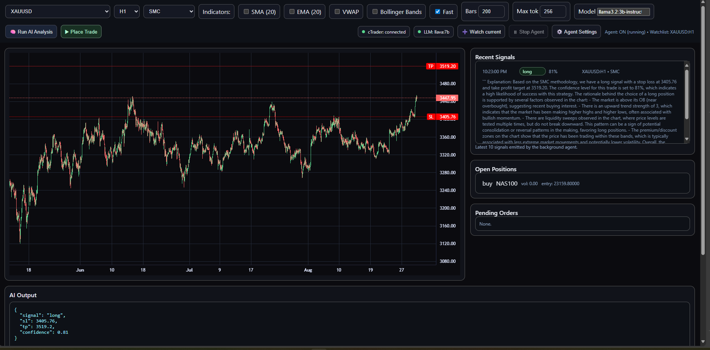
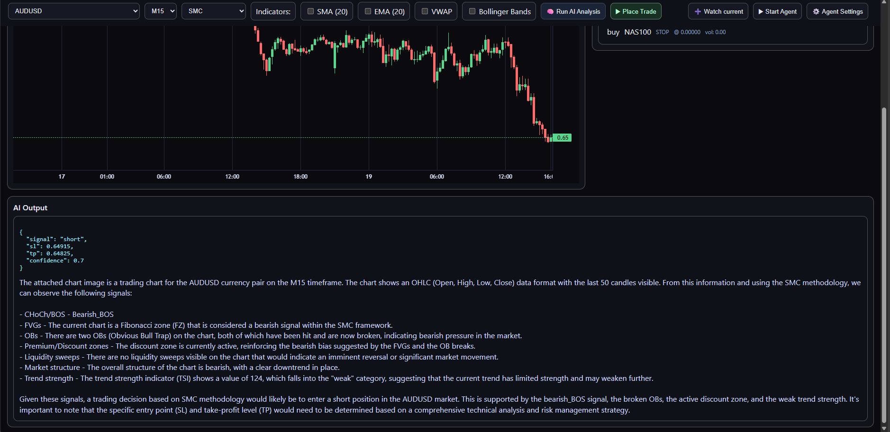
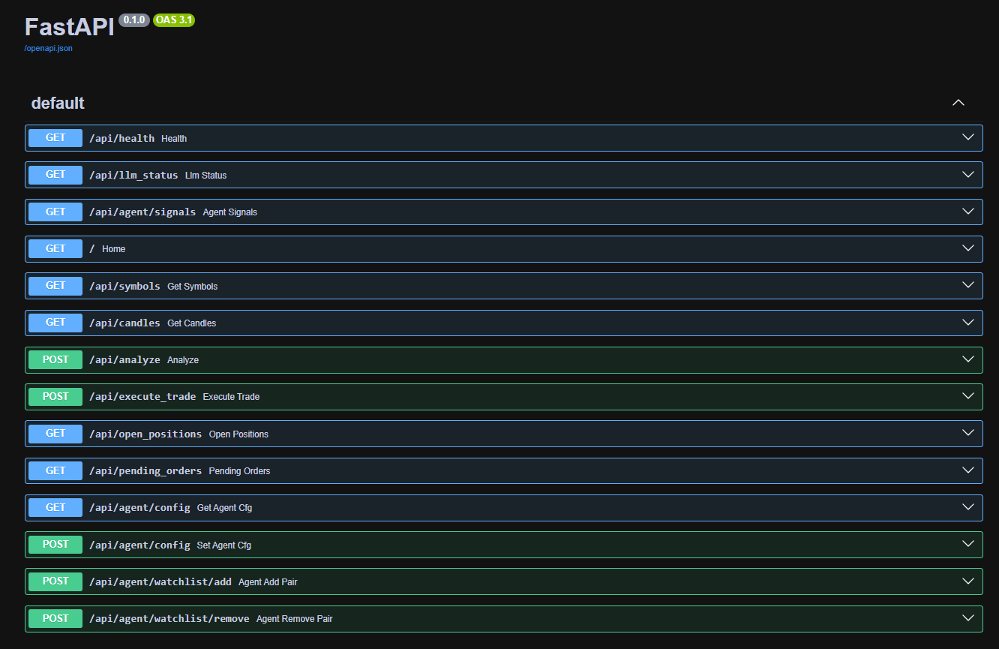

# 💹 GenAI-MultiAgent-TradingSystem

A full-stack, **local trading system** that blends **live market data** (cTrader OpenAPI) with **chart image understanding** (LLaVA via Ollama) to produce human-like trade decisions.

* **Two ways to use it**

  1. **Manual**: pick a symbol/timeframe and click **Run AI Analysis** to get a structured trade idea from an LLM vision model.
  2. **Autonomous Agent**: click **Start Agent** and let background agents monitor markets, emit **signals**, and (optionally) **trade automatically** using your risk settings.

> ⚡ Runs 100% locally via **Docker + Ollama** — **no OpenAI keys required**.

---

## ✨ Highlights

* **Multimodal LLM analysis (keeps chart images)**

  * Uses Plotly→Kaleido to snapshot the chart, compresses to JPEG, and sends it to **LLaVA** together with **last N OHLC rows** and **SMC features**.
  * Strict, machine-readable output:

    ```json
    {
      "signal": "long" | "short" | "no_trade",
      "sl": 3389.06,
      "tp": 3417.74,
      "confidence": 0.56,
      "reasons": ["plain English explanation"]
    }
    ```
* **Live trading integration (cTrader OpenAPI)**

  * Realtime candles, open positions & pending orders.
  * Market & pending order placement with SL/TP amendment logic.
  * **Paper** and **Live** modes.
* **Multi-Agent workflow (production-style roles)**

  * **Watcher / Market Observer** – streams OHLC + session/HTF bias
  * **Scout / Pattern Detector** – detects SMC objects (CHOCH/BOS, FVG, OB, liquidity)
  * **Guardian / Risk Manager** – validates SL/TP & confidence thresholds
  * **Executor / Trader** – places/updates/ closes trades (paper or live)
  * **Scribe / Journal Keeper** – records signals (optional Notion/DB hook)
  * **Commander / Supervisor** – orchestrates schedules & watchlists
* **Fast, smooth charting UI**

  * Lightweight-Charts for candles, indicator overlays (SMA/EMA/VWAP/BB), SL/TP price lines.
  * Status chips for cTrader + LLM health.
  * Signals, Open Positions, Pending Orders side panels.
* **Configurable model & performance knobs**

  * Global defaults via `.env` (e.g., `OLLAMA_MODEL=llava:7b`).
  * Per-request overrides from the UI/backend: `model`, `max_bars`, `max_tokens`, and Ollama `options`.

---

## 🏗 Architecture (at a glance)

```
┌─────────────── UI ────────────────┐
│  Manual run & Agent control       │
│  Lightweight-Charts + overlays    │
└───────────────▲───────────────────┘
                │
                │ HTTP (FastAPI)
                ▼
┌──────────── Backend (llm-smc) ────────────┐
│ - cTrader client (candles, positions)     │
│ - SMC feature extractor                   │
│ - Plotly→Kaleido chart snapshot (image)   │
│ - Multi-agent runner + controller         │
│ - Order execution                         │
└───────────────▲───────────────┬───────────┘
                │               │
                │               │
                │               ▼
                │        ┌──────────────┐
                │        │   Ollama     │  (e.g., llava:7b)
                │        └──────────────┘
                │
                ▼
       cTrader OpenAPI (live feed & orders)
```


yep—good call. A quick “repo structure” section helps reviewers grok the project fast. Here’s a drop-in block for your `README.md`:

---


## 🗂 Repository structure

```text
GenAI-MultiAgent-TradingSystem/
├─ backend/
│  ├─ app.py                 # FastAPI entrypoint: HTTP API, endpoints, wires LLM + cTrader + agents
│  ├─ ctrader_client.py      # cTrader TCP/OpenAPI client + order helpers (place/modify, positions, pending)
│  ├─ data_fetcher.py        # Candle fetcher (symbol/timeframe), thin adapter over cTrader client
│  ├─ indicators.py          # SMA/EMA/VWAP/Bollinger—merged into /api/candles response
│  ├─ llm_analyzer.py        # Plotly→image + SMC summary → Ollama (LLaVA) → parse strict trade JSON
│  ├─ smc_features.py        # SMC primitives: CHOCH/BOS, FVG, OB proximity, premium/discount
│  ├─ symbol_fetcher.py      # Discover available symbols from cTrader
│  ├─ strategy.py            # Strategy switch & stubs (SMC, RSI divergence; add more here)
│  ├─ agent_state.py         # In-memory ring buffer of recent signals (for the UI panel)
│  ├─ agent_controller.py    # Runtime agent config (enabled, interval, min_conf, mode, autotrade, lots)
│  ├─ agents/
│  │  ├─ runner.py           # Background loop: poll → analyze → emit signal → (optional) execute trades
│  │  └─ __init__.py
│  ├─ Dockerfile             # Backend image (Python + Kaleido for chart snapshots)
│  ├─ .env.example           # Example configuration
│  └─ .env                   # Local secrets & model defaults (gitignored)
├─ templates/
│  └─ index.html             # Single-page dashboard (Lightweight-Charts UI + agent controls)
├─ static/js/
│  └─ lightweight-charts.standalone.production.js
├─ images/                   # README screenshots
├─ docker-compose.yml        # Spins up Ollama + backend
├─ requirements.txt          # Backend Python deps
├─ README.md
└─ NOTES.md                  # Dev notes / scratchpad
```

### 🔧 Common edit points

* **Default LLM model**: `backend/.env → OLLAMA_MODEL` (e.g., `llava:7b`).
  Per-call override via `POST /api/analyze` body: `{"model":"llava:7b","max_bars":200,"max_tokens":256,"options":{...}}`.
* **Agent behavior**: change in the UI (**Agent Settings**) or programmatically via `/api/agent/config`.
* **Add a strategy**: extend `backend/strategy.py` + hook into `agents/runner.py` + add to the UI dropdown in `templates/index.html`.

### 🧭 Code flow (at a glance)

1. UI requests `/api/candles` → backend fetches from cTrader → UI renders chart.
2. **Manual**: UI posts to `/api/analyze` → backend snapshots chart + SMC features → LLaVA via Ollama → returns `{signal, sl, tp, confidence, reasons}`.
3. **Agent**: `agents/runner.py` loops over the watchlist on a schedule, repeats step 2, emits signals, and (if `autotrade=true` & mode=`live`) places/updates trades.


---

## 🔎 How LLM Analysis Works

1. Fetch OHLC from cTrader for the selected symbol/timeframe.
2. Render a Plotly candlestick chart (same data you see in the UI).
3. Extract SMC features (CHOCH/BOS, OB proximity, FVG, premium/discount).
4. Send **the chart image + last N OHLC rows + SMC summary** to **Ollama** (LLaVA).
5. Parse strict JSON (signal, SL, TP, confidence) + a one-line explanation.
6. Draw **SL/TP lines** on the chart and show the analysis in the panel.

> Image stays in the loop (no markdown fences). JPEG compression keeps requests fast.

---

## 🚀 Quickstart

### 1) Clone & configure

```bash
git clone https://github.com/maghdam/GenAI-MultiAgent-TradingSystem.git
cd GenAI-MultiAgent-TradingSystem
```

Create `backend/.env`:

```ini
# ===== cTrader =====
CTRADER_CLIENT_ID=...
CTRADER_CLIENT_SECRET=...
CTRADER_HOST_TYPE=demo
CTRADER_ACCESS_TOKEN=...
CTRADER_ACCOUNT_ID=...

# ===== LLM =====
OLLAMA_URL=http://ollama:11434
OLLAMA_MODEL=llava:7b   # vision model used by default

# Optional defaults
DEFAULT_SYMBOL=XAUUSD
```

### 2) Bring up the stack

```bash
docker compose up -d
```

### 3) Open the dashboard

```
http://localhost:4000
```

* Use **Run AI Analysis** for one-off insights.
* Use **Watch current** to add the current pair to the agent’s watchlist.
* Click **Start Agent** to begin the autonomous loop (interval + thresholds in **Agent Settings**).

---

## ⚙️ Model & Performance Tuning

Global defaults (in `.env`):

```ini
OLLAMA_URL=http://ollama:11434
OLLAMA_MODEL=llava:7b
```

Per-request overrides (frontend → `/api/analyze`):

```json
{
  "symbol": "XAUUSD",
  "timeframe": "H1",
  "indicators": ["SMA (20)", "EMA (20)"],
  "model": "llava:7b",
  "max_bars": 200,
  "max_tokens": 256,
  "options": { "num_thread": 6 }   // passed to Ollama
}
```

**Tips for speed on CPU**

* Keep `llava:7b` (good balance).
* Use `max_bars` \~ 150–250 and `max_tokens` \~ 192–256.
* JPEG chart is auto-compressed for faster upload.
* Ensure `OLLAMA_URL` points to your running Ollama service (Docker-compose sets this).

---

## 🧠 Agents (autonomous mode)

When **Start Agent** is ON, the supervisor wakes up every `interval_sec` and:

1. Pulls fresh candles for each `(symbol, timeframe)` in **watchlist**.
2. Builds features + chart snapshot and queries the LLM.
3. Emits a **signal** with confidence.
4. If `autotrade=true` **and** mode is **Live**, the **Executor** opens/closes positions according to your thresholds and SL/TP rules.

You can configure all of this in the UI drawer or via the API.

---

## 🔌 API (selected endpoints)

* Health & LLM

  * `GET /api/health` → `{ status, connected }`
  * `GET /api/llm_status` → `{ ollama: 200|"unreachable", model }`
* Market data

  * `GET /api/symbols`
  * `GET /api/candles?symbol=EURUSD&timeframe=M15&indicators=SMA%20(20)&indicators=VWAP`
* Manual analysis

  * `POST /api/analyze` – accepts optional `model`, `max_bars`, `max_tokens`, `options` (forwarded to Ollama)
* Trading

  * `POST /api/execute_trade`
  * `GET /api/open_positions`
  * `GET /api/pending_orders`
* Agent control

  * `GET /api/agent/config`
  * `POST /api/agent/config` *(toggle enabled, set interval/confidence/mode/autotrade/strategy)*
  * `POST /api/agent/watchlist/add?symbol=XAUUSD&timeframe=H1`
  * `POST /api/agent/watchlist/remove?symbol=XAUUSD&timeframe=H1`
  * `GET /api/agent/signals?n=10`

---

## 🖥️ UI Walkthrough

* **Status chips** show cTrader connectivity and current LLM model.
* **Indicators** let you add SMA/EMA/VWAP/BB to the server-side candle fetch.
* **AI Output** shows the JSON decision and a plain explanation.
* **SL/TP** lines appear on the chart when provided by the LLM.
* **Recent Signals** mirrors the latest agent outputs (click a row to preview on the chart).
* **Open Positions / Pending Orders** update live from cTrader.

---


## 🧰 Troubleshooting

* **LLM feels slow on CPU**: use `llava:7b`, reduce `max_bars`/`max_tokens`.
* **Chart image errors**: ensure Kaleido is available in the backend image.
* **Agent not trading**: set **Mode=Live** and **Autotrade=On**; confirm cTrader is connected and account has permissions.
* **No symbols**: wait for cTrader to load or verify your credentials in `.env`.

---

## 🗺️ Roadmap

* [ ] More strategies (MACD, Volume Profile, Order Flow)
* [ ] Backtesting & walk-forward
* [ ] Message-bus multi-agent comms + memory
* [ ] Risk dashboard (exposure, VaR)
* [ ] Cloud deploy templates (Render / Fly.io)

---

## 📸 Dashboard Example





---

## 📜 License

MIT — free to use, extend, and share.

---

## ⚠️ Disclaimer

This project is for **education and research**. It is **not financial advice**. Trading involves substantial risk. Please do NOT use live trading with a real account. First deploy this project on demo/test accounts and verify behavior thoroughly.


---


