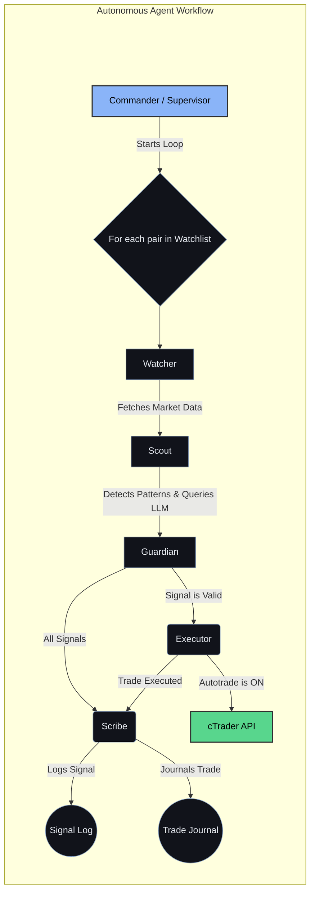

# 💹 GenAI-MultiAgent-TradingSystem

A full-stack, local-first trading platform that blends live cTrader market data with chart image understanding (llama3.2 via Ollama) to produce structured, human-like trade decisions—then executes them automatically via multi-agent workflows.

> ⚡ Runs 100% locally via **Docker + Ollama** — **no OpenAI keys required**.

---

## ✨ Key Features

*   **Multimodal LLM Analysis**: Leverages `llama3.2` to analyze chart snapshots, OHLC data, and SMC features, providing structured trade signals (long/short/no_trade) with stop-loss, take-profit, confidence levels, and detailed reasoning.
*   **Live Trading Integration**: Connects to cTrader for real-time market data, order execution (market and pending), and management of open positions. Supports both paper and live trading modes.
*   **Multi-Agent Workflow**: A production-style system with specialized agent roles:
    *   **Commander/Supervisor**: Orchestrates the trading process.
    *   **Watcher/Market Observer**: Streams market data.
    *   **Scout/Pattern Detector**: Identifies SMC patterns.
    *   **Guardian/Risk Manager**: Validates trade signals and risk.
    *   **Executor/Trader**: Executes trades.
    *   **Scribe/Journal Keeper**: Logs all trading activity.
*   **Interactive Charting UI**: A smooth and responsive interface built with Lightweight-Charts, featuring indicator overlays, real-time status updates, and side panels for signals and positions.
*   **AI Assistant (Chatbot)**: A conversational interface for technical and fundamental analysis, agent control, and trade execution.
*   **Automatic Trade Journaling**: All trades are automatically logged to a local SQLite database for immutable record-keeping.
*   **Configurable and Extensible**: Easily configure the LLM model, agent behavior, and trading parameters. The system is designed to be extensible with new strategies.

---

## 🏗 Architecture

The system is composed of a frontend UI, a backend server, and an Ollama container for local LLM inference.

```
┌─────────────── UI ────────────────┐
│  Manual run & Agent control       │
│  Lightweight-Charts + overlays    │
└───────────────▲───────────────────┘
                │
                │ HTTP (FastAPI)
                ▼
┌──────────── Backend (llm-smc) ────────────┐
│ - cTrader client (candles, positions)     │
│ - SMC feature extractor                   │
│ - Plotly→Kaleido chart snapshot (image)   │
│ - Multi-agent runner + controller         │
│ - Order execution                         │
└───────────────▲───────────────┬───────────┘
                │               │
                │               │
                │               ▼
                │        ┌──────────────┐
                │        │   Ollama     │  (e.g., llama3.2)
                │        └──────────────┘
                │
                ▼
       cTrader OpenAPI (live feed & orders)
```

---

## 🚀 Getting Started

### Prerequisites

*   [Docker](https://www.docker.com/get-started)
*   [Git](https://git-scm.com/downloads)

### 1. Clone and Configure

```bash
git clone https://github.com/maghdam/GenAI-MultiAgent-TradingSystem.git
cd GenAI-MultiAgent-TradingSystem
```

Create a `backend/.env` file from the example:

```ini
# ===== cTrader =====
CTRADER_CLIENT_ID=...
CTRADER_CLIENT_SECRET=...
CTRADER_HOST_TYPE=demo
CTRADER_ACCESS_TOKEN=...
CTRADER_ACCOUNT_ID=...

# ===== LLM =====
OLLAMA_URL=http://ollama:11434
OLLAMA_MODEL=llama3.2   # vision model used by default

# Optional defaults
DEFAULT_SYMBOL=XAUUSD
```

### 2. Start the Application

```bash
docker compose up -d
```

### 3. Access the Dashboard

Open your browser and navigate to `http://localhost:8080`.

---

## 📖 How to Use

*   **Manual Analysis**: Select a symbol and timeframe, then click **Run AI Analysis** to get a trade idea from the LLM.
*   **Autonomous Agent**: Add the current symbol to the agent's watchlist by clicking **Watch current**. Then, start the autonomous trading loop by clicking **Start Agent**.
*   **AI Assistant**: Use the chat widget in the bottom-right corner to interact with the system using natural language.

---

## 🤖 Agent-Based Autonomous Trading

The autonomous mode uses a multi-agent system to monitor markets, generate signals, and execute trades.

### Agent Workflow



### Configuration

Agent behavior can be configured in the UI (**Agent Settings**) or via the API. Key settings include:
*   `enabled`: Start or stop the agent.
*   `interval_sec`: The interval for the agent to check for new signals.
*   `confidence_threshold`: The minimum confidence level for a signal to be considered for a trade.
*   `trading_mode`: `live` or `paper`.
*   `autotrade`: `true` or `false`.

---

## 💬 AI Assistant (Chatbot)

The AI assistant provides a conversational interface for various actions:

*   **Technical Analysis & Trading**: `buy 0.1 lots of EURUSD`, `run analysis on the current chart`
*   **Fundamental Analysis**: `news for EURUSD`, `what's the latest on US inflation?`
*   **Agent & System Control**: `start agents`, `stop agents`, `what is the agent status?`

---

## ⚙️ Configuration

*   **LLM Model**: Set the default model in `backend/.env` with the `OLLAMA_MODEL` variable. You can also override the model per request in the UI or API.
*   **Agent Behavior**: Configure agent settings in the UI or programmatically via the `/api/agent/config` endpoint.
*   **Strategies**: Extend the system with new strategies by modifying `backend/strategy.py` and `backend/agents/runner.py`.

---

## 🔌 API Endpoints

*   `GET /api/health`: Check the health of the system.
*   `GET /api/llm_status`: Check the status of the LLM.
*   `GET /api/symbols`: Get a list of available symbols.
*   `GET /api/candles`: Get candle data for a symbol.
*   `POST /api/analyze`: Run a manual analysis.
*   `POST /api/execute_trade`: Execute a trade.
*   `GET /api/open_positions`: Get open positions.
*   `GET /api/pending_orders`: Get pending orders.
*   `GET /api/agent/config`: Get the agent configuration.
*   `POST /api/agent/config`: Set the agent configuration.
*   `POST /api/agent/watchlist/add`: Add a symbol to the agent's watchlist.
*   `POST /api/agent/watchlist/remove`: Remove a symbol from the agent's watchlist.
*   `GET /api/agent/signals`: Get recent agent signals.
*   `GET /api/agent/status`: Get the status of the agent.
*   `GET /api/journal/trades`: Get all recorded trades.
*   `POST /api/chat/stream`: The streaming chat endpoint.

---

## 🗂 Repository Structure

```text
GenAI-MultiAgent-TradingSystem/
├─ backend/
├─ frontend/
├─ docs/
├─ docker-compose.yml
├─ requirements.txt
└─ README.md
```

---

## 🧰 Troubleshooting

*   **Slow LLM on CPU**: Use a smaller model like `llama3.2` and reduce `max_bars` and `max_tokens`.
*   **Chart image errors**: Ensure Kaleido is installed in the backend Docker image.
*   **Agent not trading**: Make sure **Mode=Live** and **Autotrade=On**.
*   **No symbols**: Wait for cTrader to connect or check your credentials in `.env`.

---

## 🗺️ Roadmap

*   [x] **Fundamental Analysis:** Integrate news and event data into the chatbot.
*   [ ] More strategies (MACD, Volume Profile, Order Flow)
*   [ ] Backtesting & walk-forward
*   [ ] Message-bus multi-agent comms + memory
*   [ ] Risk dashboard (exposure, VaR)
*   [ ] Cloud deploy templates (Render / Fly.io)

---

## 📸 Dashboard Screenshots


---

## 📜 License

This project is licensed under the MIT License. See the [LICENSE](LICENSE) file for details.

---

## ⚠️ Disclaimer

This project is for educational and research purposes only. It is not financial advice. Trading involves substantial risk. Do not use this project for live trading with a real account without fully understanding the risks involved.