# TradeAgent

TradeAgent is a local-first AI trading workstation prototype. It combines a FastAPI backend, a React frontend, broker-connected market data, a deterministic paper-trading engine, SQLite-backed audit trails, and an LLM-assisted Strategy Studio for creating and backtesting trading ideas.

The project is intended to show AI product engineering rather than prompt-only experimentation: operator controls, explicit risk boundaries, persistent state, testing, research workflows, and a UI that supports the full operating loop.

## What It Demonstrates

- multi-surface product, not a single demo screen
- deterministic paper execution with explicit guardrails
- LLM-assisted strategy drafting, editing, and backtesting
- persistent runtime, incidents, intents, positions, and audit history
- broker-connected market data and trading context
- architecture that separates operator workflows, runtime execution, and research tooling

## Product Gallery

### Main Dashboard

<p align="center">
  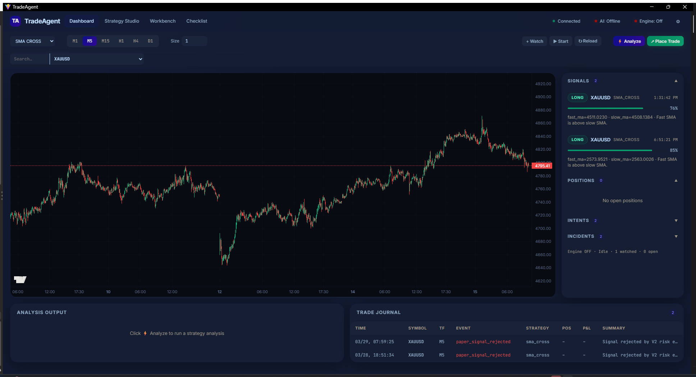
</p>
<p align="center">
  <sub>Execution-facing dashboard with live charting, AI analysis, signal panels, and trade journal context.</sub>
</p>

### Additional Views

| Operator Workbench | Strategy Studio |
| --- | --- |
| 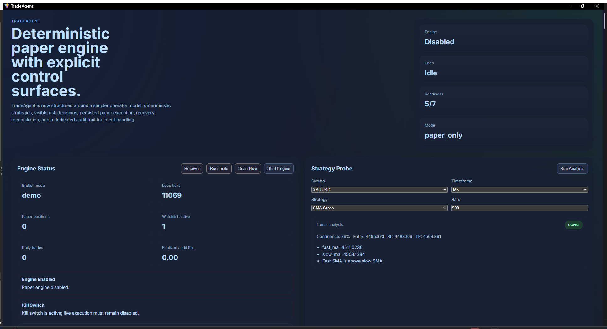<br /><sub>Control plane for engine state, guardrails, watchlists, and audit visibility.</sub> | 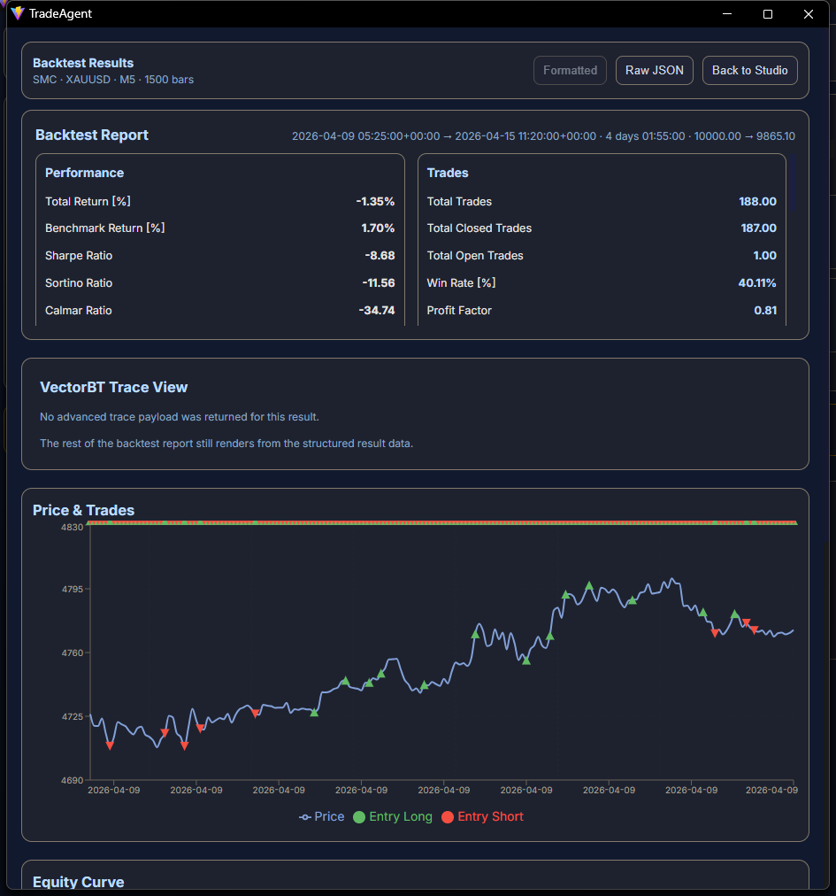<br /><sub>Strategy Studio result view with a real seeded backtest payload, report metrics, and trade visualization.</sub> |

<p align="center">
  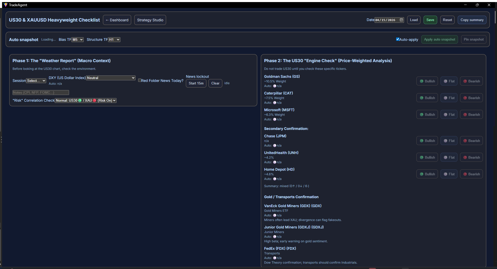
</p>
<p align="center">
  <sub>Structured checklist flow for US30/XAUUSD macro context, scenario framing, and execution discipline.</sub>
</p>

### Expanded Workflow Views

<details>
  <summary>Workbench continuation</summary>
  <p align="center">
    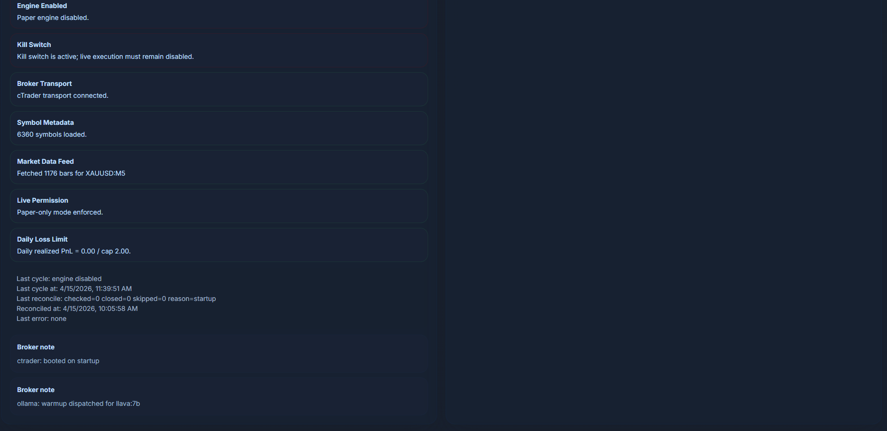
  </p>
  <p align="center">
    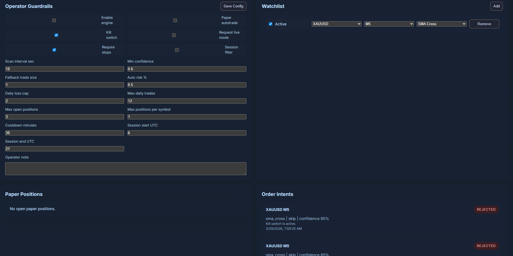
  </p>
  <p align="center">
    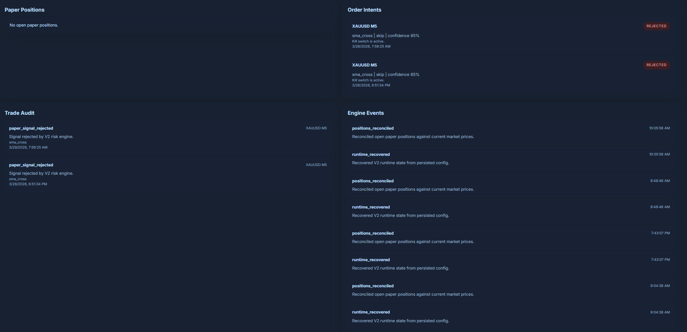
  </p>
</details>

<details>
  <summary>Strategy Studio continuation</summary>
  <p align="center">
    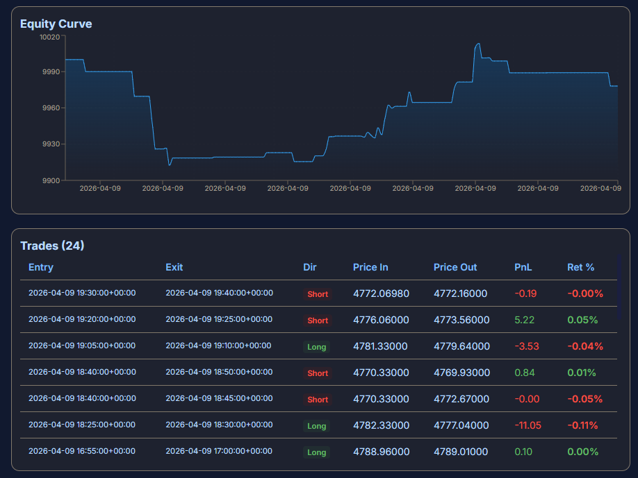
  </p>
</details>

<details>
  <summary>Heavyweight Checklist continuation</summary>
  <p align="center">
    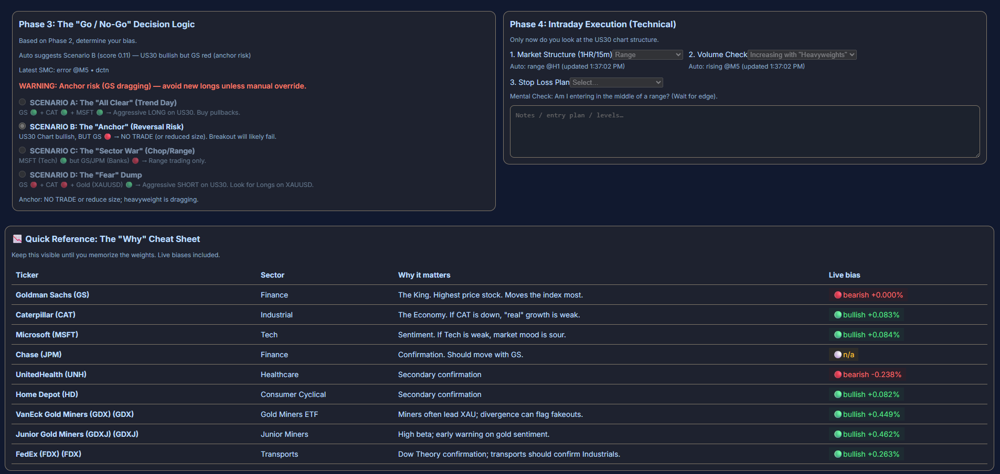
  </p>
  <p align="center">
    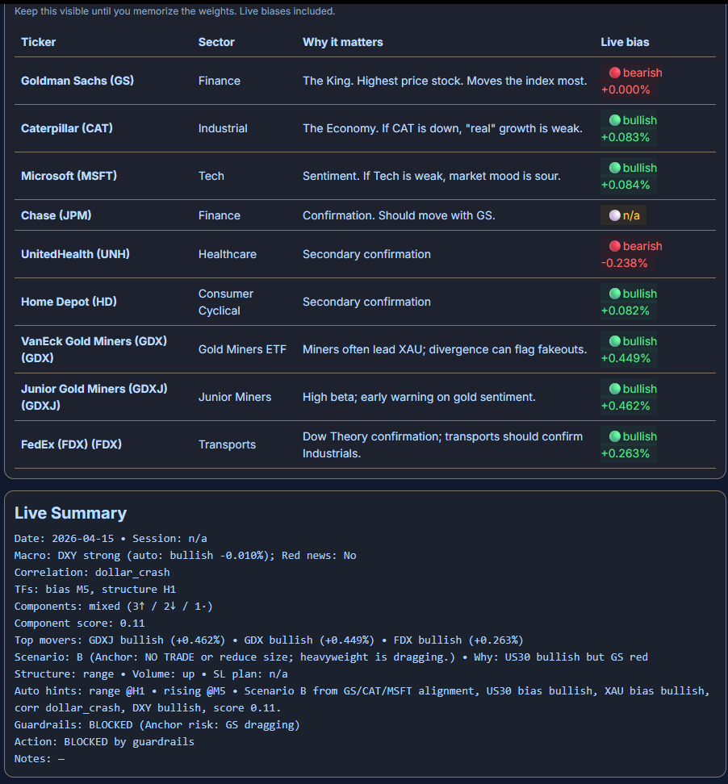
  </p>
</details>

### Supplemental Prototype Views

<details>
  <summary>Earlier dashboard and assistant flow</summary>
  <p align="center">
    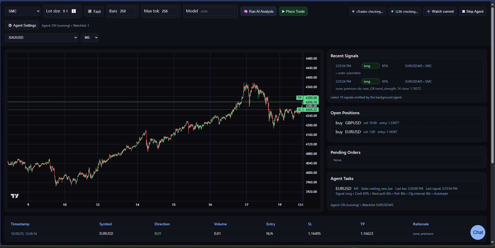
  </p>
  <p align="center">
    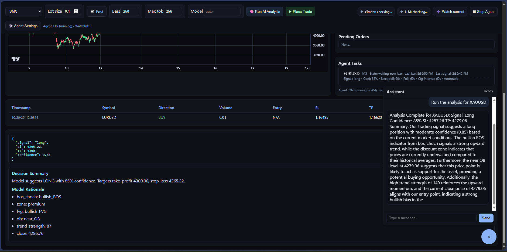
  </p>
</details>

<details>
  <summary>Earlier Strategy Studio generation and backtest flow</summary>
  <p align="center">
    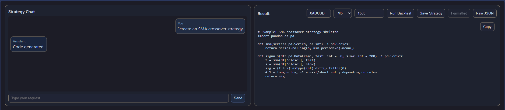
  </p>
  <p align="center">
    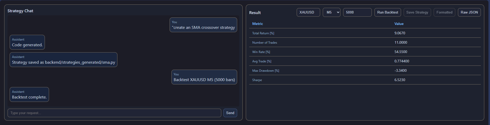
  </p>
</details>

<details>
  <summary>FastAPI API surface snapshot</summary>
  <p align="center">
    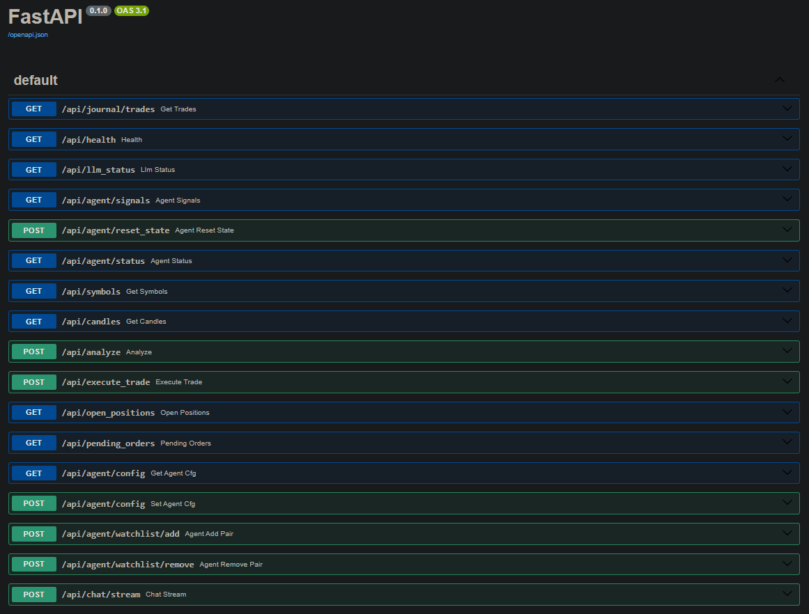
  </p>
</details>

## Main Capabilities

### Dashboard

- live market charting
- strategy selection and symbol/timeframe controls
- AI analysis output and manual trade actions
- signals, incidents, intents, and trade journal panels
- broker, engine, and model readiness indicators

### Operator Workbench

- engine start/stop, manual scan, reconcile, and recovery
- readiness checks and broker notes
- watchlist management
- persistent config for confidence, daily loss, cooldowns, session filter, and position limits
- paper positions, order intents, audit records, and incident feeds

### Strategy Studio

- natural-language strategy chat
- provider/model selection
- draft strategy generation and refinement
- save-to-disk strategy workflow
- saved and draft backtesting
- formatted backtest dashboards and raw result inspection

### Heavyweight Checklist

- macro checklist and scenario framework
- US30/XAUUSD decision support
- component confirmation flow
- auto-snapshot integration from backend checklist and calendar endpoints

## How The Agent System Works

TradeAgent currently has two AI-related execution surfaces:

- Runtime trading engine:
  one orchestrated paper-trading loop scans a watchlist, fetches bars, runs a deterministic strategy, passes the result through risk and sizing checks, and records intents and paper-trade audit history.
- Strategy Studio:
  an LLM-assisted research workflow can chat, draft strategy code, backtest drafts or saved files, and save strategies into `backend/strategies_generated/`.

The repo is best described as an agent-inspired, service-oriented design rather than a swarm of independently deployed worker agents. The agent roles still exist conceptually, but the active implementation is a consolidated V2 engine plus a separate Strategy Studio task pipeline.

See [ARCHITECTURE.md](ARCHITECTURE.md) for the current diagrams, agent-role mapping, runtime flow, and documentation of what is active versus legacy.

## Architecture At A Glance

<p align="center">
  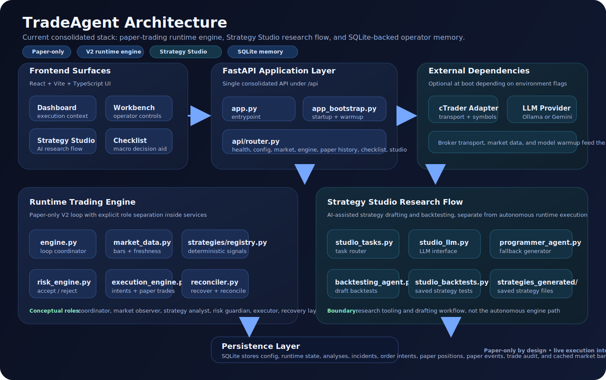
</p>
<p align="center">
  <sub>Current-state architecture: frontend surfaces, FastAPI layer, paper-trading runtime engine, Strategy Studio research flow, and SQLite-backed memory.</sub>
</p>

## Tech Stack

- FastAPI
- React 19 + Vite + TypeScript
- SQLite
- cTrader Open API integration
- Ollama and Gemini-ready model routing for Strategy Studio
- Recharts and lightweight-charts

## Quick Start

### One-command local startup

```powershell
cmd /c call start-local.cmd
```

This starts:

- backend on `http://127.0.0.1:4000`
- frontend on `http://127.0.0.1:5173`

### Manual startup

Backend:

```powershell
set APP_START_CTRADER_ON_BOOT=1
set APP_WARM_OLLAMA_ON_BOOT=1
set OLLAMA_URL=http://127.0.0.1:11434
set PYTHONPATH=%CD%
C:\Users\mohag\miniconda3\python.exe -m uvicorn backend.app:app --host 127.0.0.1 --port 4000
```

Frontend:

```powershell
cd frontend
set VITE_API_BASE=http://127.0.0.1:4000
npm.cmd run dev -- --host 127.0.0.1 --port 5173
```

## Verification

Verified locally on April 15, 2026:

```powershell
python -m pytest backend\tests -q
cd frontend
npm.cmd run build
```

Result:

- `52` backend tests passed
- frontend production build passed

## Documentation

- [ARCHITECTURE.md](ARCHITECTURE.md): current system architecture, runtime flow, agent-role mapping, diagrams, and active boundaries
- [docs/operations/local-run.md](docs/operations/local-run.md): local startup, environment flags, verification commands, and troubleshooting
- [docs/TRADEAGENT.md](docs/TRADEAGENT.md): lightweight documentation index and migration note

## Current Constraints

- autonomous execution is paper-only
- live mode can be requested in config, but live execution remains intentionally blocked
- broker connectivity and market data depend on the local cTrader/Open API environment
- Strategy Studio quality depends on the configured local or remote model

## Why It Works As A Portfolio Project

This repo shows more than model integration. It shows how AI features can be placed inside a product with operational boundaries, state, observability, recovery paths, and a clear separation between research tooling and execution logic.

## License

[MIT](LICENSE)
