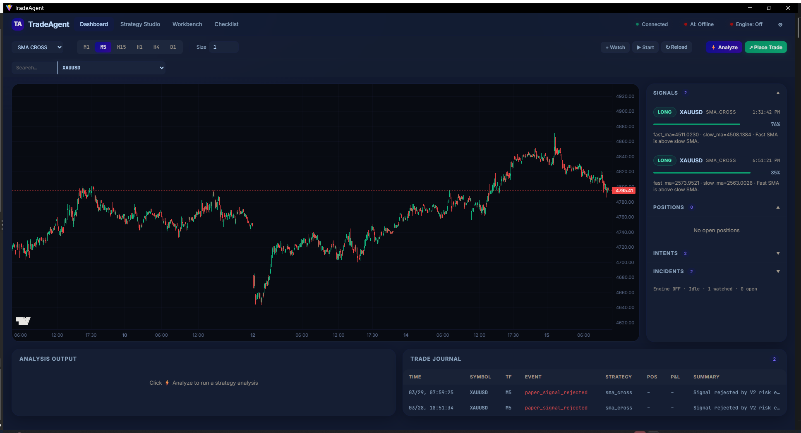
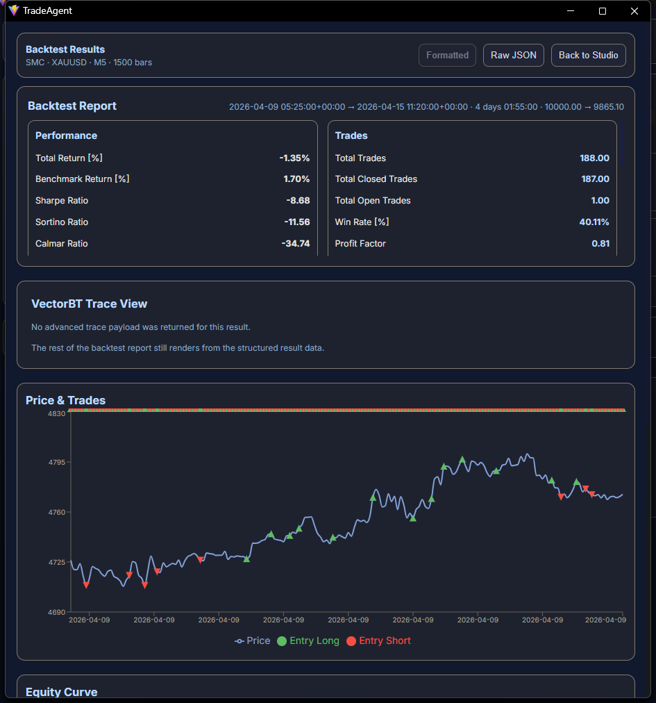
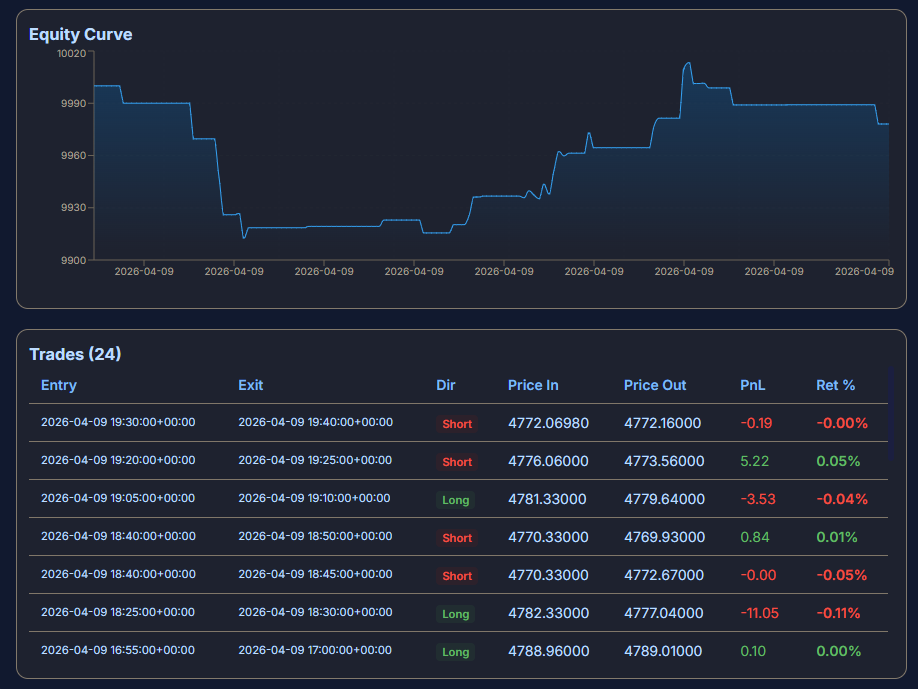
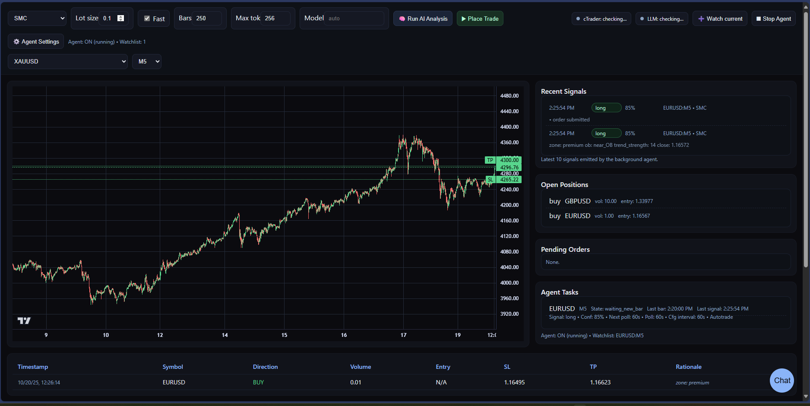
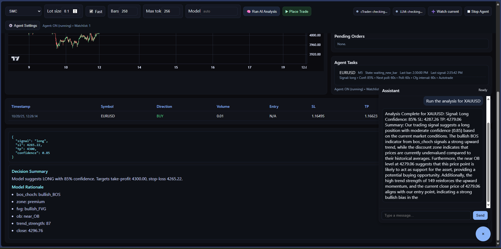
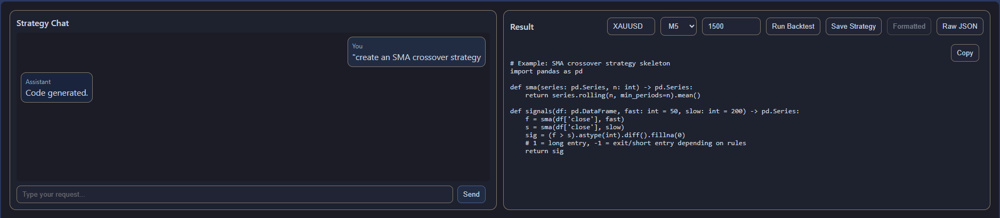
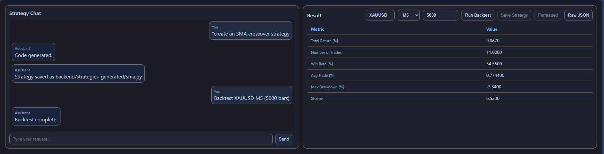
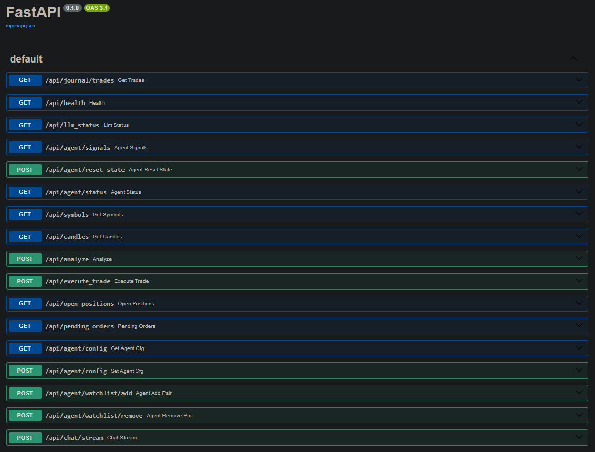
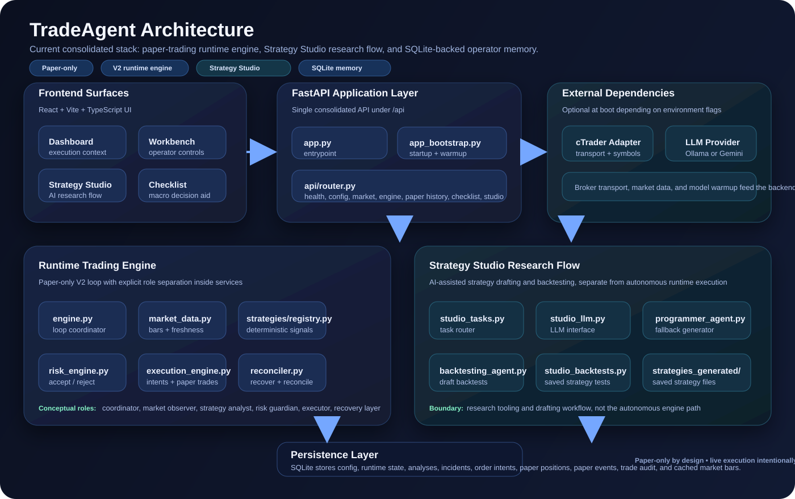

# TradeAgent

TradeAgent is a local-first trading workstation organized into three connected areas: Trade, Build & Test, and System. It combines a FastAPI backend, React frontend, broker-connected market data, deterministic paper execution, SQLite-backed audit trails, and LLM-assisted research.

The project is intended to show AI product engineering rather than prompt-only experimentation: operator controls, explicit risk boundaries, persistent state, testing, research workflows, and a UI that supports the full operating loop.

## What It Demonstrates

- one methodological workflow across Trade, Build & Test, and System
- deterministic paper execution with explicit guardrails
- LLM-assisted strategy drafting, editing, and backtesting
- persistent runtime, incidents, intents, positions, and audit history
- broker-connected market data and trading context
- architecture that separates operator workflows, runtime execution, and research tooling

## Product Gallery

### Trade

<p align="center">
  
</p>
<p align="center">
  <sub>Daily trading workspace with live charting, selected-market context, explicit strategy analysis, signals, positions, and journal context.</sub>
</p>

### Build & Test

<p align="center">
  
</p>
<p align="center">
  
</p>
<p align="center">
  <sub>LLM-assisted research workflow with strategy drafting, saved strategies, formatted metrics, equity curve, and trade-level backtest output.</sub>
</p>

<details>
  <summary>Earlier prototype snapshots</summary>
  <p align="center">
    
  </p>
  <p align="center">
    
  </p>
  <p align="center">
    
  </p>
  <p align="center">
    
  </p>
  <p align="center">
    
  </p>
</details>

## Main Capabilities

### Trade

- live charting, selected-market context, and explicit strategy rules
- watchlist, symbol, timeframe, and strategy selection
- signal review, paper orders, positions, and trade journal
- broker, market-data, engine, and model status

### Build & Test

- measurable hypothesis and strategy lifecycle
- natural-language research assistance with visible generated rules
- saved and draft backtesting with fees and slippage
- event-outcome calibration and original-versus-shadow replay
- paper evidence and controlled promotion decisions

### System

- engine start/stop, one-shot scan, reconciliation, and recovery
- readiness and connection diagnostics
- risk, session, stop, cooldown, and loss controls
- decision, trade, engine-event, and incident audit trails

## How The Agent System Works

TradeAgent has one trading runtime and one separate research assistant:

- Runtime trading engine:
  one orchestrated paper-trading loop scans a watchlist, fetches bars, runs a deterministic strategy, passes the result through risk and sizing checks, and records intents and paper-trade audit history.
- Build & Test research pipeline:
  an LLM-assisted research workflow can chat, draft strategy code, backtest drafts or saved files, and save strategies into `backend/strategies_generated/`.

The repo is best described as an agent-inspired, service-oriented design rather than a swarm of independently deployed worker agents. The product workflow is consolidated into Trade, Build & Test, and System, while the backend retains explicit runtime and research boundaries.

See [ARCHITECTURE.md](ARCHITECTURE.md) for the current diagrams, agent-role mapping, runtime flow, and documentation of what is active versus legacy.

## Architecture At A Glance

<p align="center">
  
</p>
<p align="center">
  <sub>Current-state architecture: Trade, Build & Test, System, FastAPI services, deterministic paper runtime, and SQLite-backed audit memory.</sub>
</p>

## Tech Stack

- FastAPI
- React 19 + Vite + TypeScript
- SQLite
- cTrader Open API integration
- Ollama and Gemini-ready model routing for Strategy Studio
- Recharts and lightweight-charts

## Quick Start

### One-command local startup

```powershell
cmd /c call start-local.cmd
```

This starts:

- backend on `http://127.0.0.1:4000`
- frontend on `http://127.0.0.1:5173`

### Manual startup

Backend:

```powershell
set APP_START_CTRADER_ON_BOOT=1
set APP_WARM_OLLAMA_ON_BOOT=1
set OLLAMA_URL=http://127.0.0.1:11434
set PYTHONPATH=%CD%
C:\Users\mohag\miniconda3\python.exe -m uvicorn backend.app:app --host 127.0.0.1 --port 4000
```

Frontend:

```powershell
cd frontend
set VITE_API_BASE=http://127.0.0.1:4000
npm.cmd run dev -- --host 127.0.0.1 --port 5173
```

## Verification

Verified locally on April 15, 2026:

```powershell
python -m pytest backend\tests -q
cd frontend
npm.cmd run build
```

Result:

- `52` backend tests passed
- frontend production build passed

## Documentation

- [ARCHITECTURE.md](ARCHITECTURE.md): current system architecture, runtime flow, agent-role mapping, diagrams, and active boundaries
- [docs/operations/local-run.md](docs/operations/local-run.md): local startup, environment flags, verification commands, and troubleshooting
- [docs/TRADEAGENT.md](docs/TRADEAGENT.md): lightweight documentation index and migration note

## Current Constraints

- autonomous execution supports local paper positions and explicitly enabled cTrader demo-account orders
- cTrader execution stays blocked until the API confirms the configured account has `isLive = false`; live-account execution remains intentionally blocked
- broker connectivity and market data depend on the local cTrader/Open API environment
- Strategy Studio quality depends on the configured local or remote model

## Why It Works As A Portfolio Project

This repo shows more than model integration. It shows how AI features can be placed inside a product with operational boundaries, state, observability, recovery paths, and a clear separation between research tooling and execution logic.

## License

[MIT](LICENSE)
