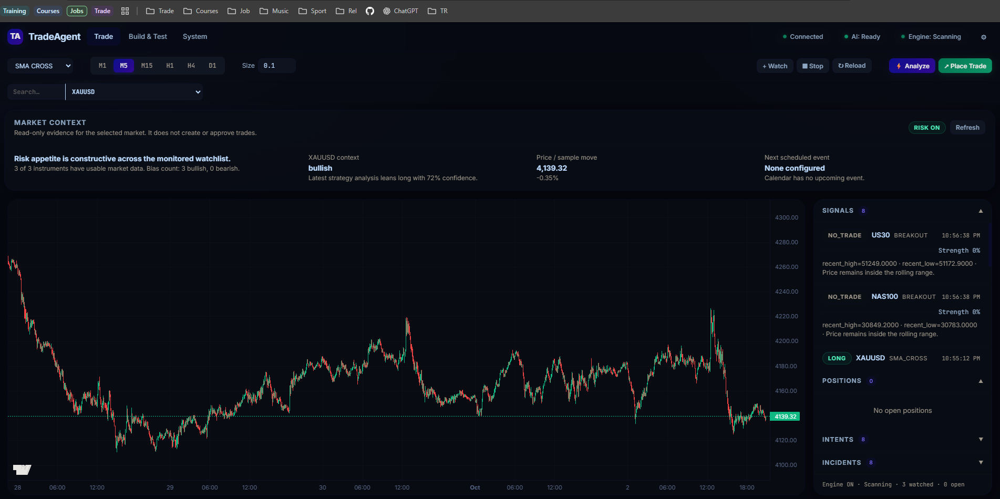
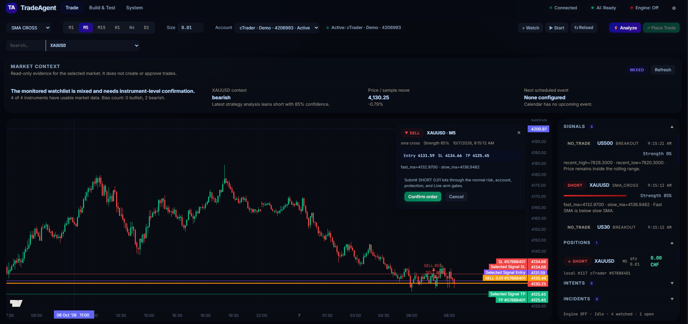
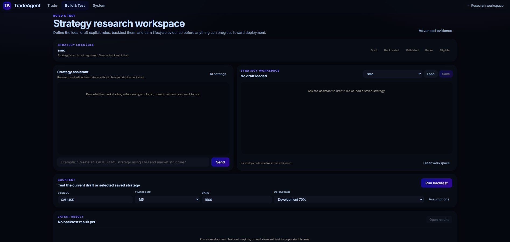
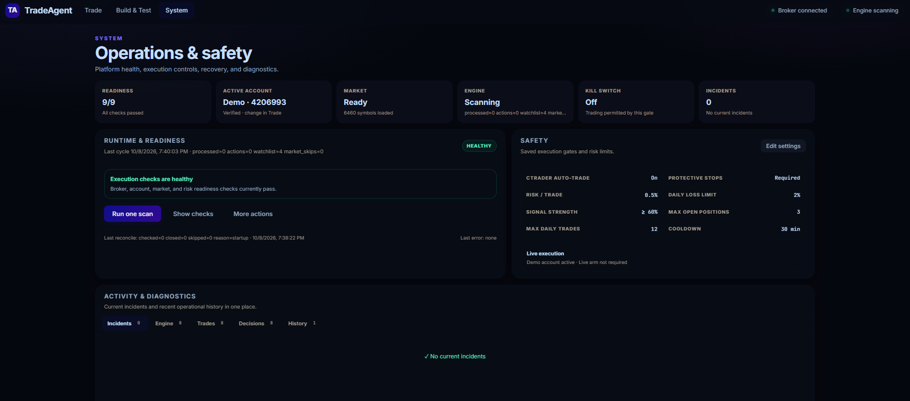

# TradeAgent

TradeAgent is a local-first trading workstation organized into three connected areas: Trade, Build & Test, and System. It combines a FastAPI backend, React frontend, broker-connected market data, deterministic local paper execution, guarded cTrader execution on an explicitly selected Demo or Live account, SQLite-backed audit trails, and LLM-assisted research.

The project is intended to show AI product engineering rather than prompt-only experimentation: operator controls, explicit risk boundaries, persistent state, testing, research workflows, and a UI that supports the full operating loop.

## What It Demonstrates

- one methodological workflow across Trade, Build & Test, and System
- deterministic local paper execution plus one guarded cTrader execution path for an explicitly selected Demo or Live account
- LLM-assisted strategy drafting, editing, and backtesting
- persistent runtime, incidents, intents, positions, and audit history
- broker-connected market data and trading context
- architecture that separates operator workflows, runtime execution, and research tooling

## Product Gallery

### Trade

<p align="center">
  
</p>
<p align="center">
  <sub>Current trading workspace with direct cTrader account selection, selected-versus-active account truth, Live-money safety state, live market context, charting, deterministic signal review, positions, intents/incidents, and broker/engine/model status.</sub>
</p>

<p align="center">
  
</p>
<p align="center">
  <sub>Chart-native signal review: actionable signals are plotted on their candles, the selected signal overlays its exact saved Entry, SL, and TP levels, and the operator can explicitly Confirm or Cancel submission even while the automated engine is stopped. Confirmed orders still pass through the normal risk, account, protection, and Live-arm gates.</sub>
</p>

### Build & Test

<p align="center">
  
</p>
<p align="center">
  <sub>Compact research workspace for GenAI-assisted strategy drafting, explicit lifecycle progression, saved/draft backtesting, validation methodology, lifecycle evidence, and controlled promotion.</sub>
</p>

### System

<p align="center">
  
</p>
<p align="center">
  <sub>Compact operations workspace for runtime health, read-only active-account truth/readiness, safety configuration, diagnostics, recovery/reconciliation, and audit. Account selection and engine Start/Stop remain on Trade.</sub>
</p>


## Main Capabilities

### Trade

- live charting, selected-market context, and explicit strategy rules
- watchlist, symbol, timeframe, strategy, and authorized cTrader account selection directly from the Trade workspace
- chart-native actionable signal markers with exact Entry/SL/TP review and guarded operator Confirm/Cancel submission, alongside separately enabled automated execution
- local paper orders/positions, explicitly enabled cTrader orders on the selected account, and trade journal
- broker, market-data, engine, and model status

### Build & Test

- measurable hypothesis and strategy lifecycle
- natural-language research assistance with visible generated rules
- saved and draft backtesting with fees and slippage
- event-outcome calibration and original-versus-shadow replay
- paper evidence and controlled promotion decisions

### System

- read-only engine state plus one-shot scan, reconciliation, and recovery diagnostics
- readiness, broker connection, active-account truth, and incident visibility
- risk, session, stop, cooldown, and loss controls
- decision, trade, engine-event, and incident audit trails

## How The Agent System Works

TradeAgent has one trading runtime and one separate research assistant:

- Runtime trading engine:
  one orchestrated trading loop scans a watchlist, fetches bars, runs a deterministic strategy, passes the result through risk and sizing checks, and records intents plus the local position/audit ledger. When cTrader auto-trading is explicitly enabled, the selected account is authenticated and execution-ready, the kill switch permits trading, and per-symbol auto-trade is enabled, accepted orders may route to that selected Demo or Live account. The same sizing, monetary-account verification, protective-stop, position-limit, reconciliation, recovery, and audit controls apply to both account types.
- Build & Test research pipeline:
  an LLM-assisted research workflow can chat, draft strategy code, backtest drafts or saved files, and save strategies into `backend/strategies_generated/`.

The repo is best described as an agent-inspired, service-oriented design rather than a swarm of independently deployed worker agents. The product workflow is consolidated into Trade, Build & Test, and System, while the backend retains explicit runtime and research boundaries.

See [ARCHITECTURE.md](ARCHITECTURE.md) for the current diagrams, agent-role mapping, runtime flow, and documentation of what is active versus legacy.

## Architecture At A Glance

<p align="center">
  
</p>
<p align="center">
  <sub>Current-state architecture: Trade, Build & Test, System, FastAPI services, deterministic local paper runtime with account-verified cTrader routing, and SQLite-backed audit memory.</sub>
</p>

## Tech Stack

- FastAPI
- React 19 + Vite + TypeScript
- SQLite
- cTrader Open API integration
- Ollama and Gemini-ready model routing for Strategy Studio
- Recharts and lightweight-charts

## Quick Start

### One-command local startup

```powershell
cmd /c call start-local.cmd
```

This starts:

- backend on `http://127.0.0.1:4000`
- frontend on `http://127.0.0.1:5173`

### cTrader account setup

Configure one cTrader Open API application/access token, not one credential block per trading account. On Windows, TradeAgent reads `CTRADER_CLIENT_ID`, `CTRADER_CLIENT_SECRET`, and `CTRADER_ACCESS_TOKEN` from **Windows Credential Manager** before considering environment-variable fallback. Use `python scripts/manage_ctrader_credentials.py set` for a fresh setup, or migrate an existing ignored `backend/.env` with `python scripts/manage_ctrader_credentials.py migrate --env-file backend/.env --scrub-env`. The migration verifies the Credential Manager writes before removing those three secret assignments and never prints their values.

The access token supplies the authorized account directory, and TradeAgent discovers the available accounts with their broker-reported Demo/Live type. Select the account directly from the Trade toolbar; System reports the active/verified account as read-only operational truth. Trade shows saved selection separately from the currently authenticated Active account and surfaces the Live-money armed/disarmed state. The selection is persisted in local SQLite and restored on restart; the credential values themselves are not stored in SQLite.

`CTRADER_HOST_TYPE` and `CTRADER_ACCOUNT_ID` remain non-secret bootstrap/fallback values for initial discovery or migration and may stay in the local ignored `backend/.env`. Environment-variable credentials remain supported for non-Windows/CI use, but a normal Windows workstation should keep the three cTrader secrets out of plaintext project files.

> **Trading risk:** use a Demo account for development, testing, and strategy validation. A selected/authenticated Live account is **disarmed for new real-money entries by default**. Live entry submission requires cTrader auto-trade, per-symbol auto-trade, the kill switch off, **and an explicit runtime-only Live Trading arm for the currently active Live account**. That arm resets on account changes, engine restart, and backend restart. Existing broker-backed positions remain eligible for protection, reconciliation, and verified-close handling even while new Live entries are disarmed.

### Manual startup

Backend:

```powershell
set APP_START_CTRADER_ON_BOOT=1
set APP_WARM_OLLAMA_ON_BOOT=1
set OLLAMA_URL=http://127.0.0.1:11434
set PYTHONPATH=%CD%
C:\Users\mohag\miniconda3\python.exe -m uvicorn backend.app:app --host 127.0.0.1 --port 4000
```

Frontend:

```powershell
cd frontend
set VITE_API_BASE=http://127.0.0.1:4000
npm.cmd run dev -- --host 127.0.0.1 --port 5173
```

## Verification

Canonical repository validation:

```powershell
python scripts\validate.py
```

The validator uses the Python interpreter that launches it, runs the accepted backend suite (`python -m pytest backend/tests -q`), then runs the frontend production build (`npm --prefix frontend run build`). It exits non-zero on the first failed validation step.

Verified locally on October 4, 2026:

- `428` backend tests passed
- frontend production build passed

## Documentation

- [ARCHITECTURE.md](ARCHITECTURE.md): current system architecture, runtime flow, agent-role mapping, diagrams, and active boundaries
- [docs/operations/local-run.md](docs/operations/local-run.md): local startup, environment flags, verification commands, and troubleshooting
- [docs/TRADEAGENT.md](docs/TRADEAGENT.md): lightweight documentation index and migration note

## Current Constraints

- autonomous execution supports local paper positions plus explicitly enabled cTrader execution on the selected authenticated Demo or Live account
- cTrader execution fails closed until the selected account is active, authorized, monetary account truth and symbol metadata are verified, and the configured safety gates permit trading
- Demo accounts are strongly recommended for development/testing; Live execution carries real financial risk
- broker connectivity and market data depend on the local cTrader/Open API environment
- Strategy Studio quality depends on the configured local or remote model

## Why It Works As A Portfolio Project

This repo shows more than model integration. It shows how AI features can be placed inside a product with operational boundaries, state, observability, recovery paths, and a clear separation between research tooling and execution logic.

## License

[MIT](LICENSE)
