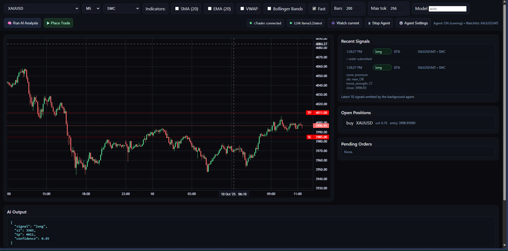

# 💹 GenAI-MultiAgent-TradingSystem

A full-stack, **local trading system** that blends **live market data** (cTrader OpenAPI) with **chart image understanding** (LLaVA via Ollama) to produce human-like trade decisions.
The default strategy is **Smart Money Concepts (SMC)**, but you can switch to **RSI divergence** or any indicator-based logic by adjusting one prompt.

> ⚡ Runs 100% locally with **Docker** + **Ollama** — **no OpenAI keys required**.

---

## ✨ Features

* **Multimodal LLM Analysis**

  * Combines **OHLC data** + **auto-captured chart screenshots** (Plotly → Kaleido → PNG).
  * Vision model (**LLaVA**) interprets charts, text models read structured features (SMC/RSI/indicators).
  * Outputs strict JSON:

    ```json
    { "signal": "long", "sl": 1.1659, "tp": 1.1682, "confidence": 0.73, "reasons": ["..."] }
    ```

* **Trading Integration**

  * Realtime candles, open positions, and pending orders via **cTrader OpenAPI**.
  * Market & pending order execution with SL/TP.
  * Works in **paper** or **live** mode.

* **Multi-Agent Workflow**
  Each agent has a role in the trading loop:

  1. **Watcher / Market Observer** 👀 — collects OHLC + session/HTF/MTF bias
  2. **Scout / Pattern Detector** 🔎 — finds CHOCH, BOS, OBs, FVGs, divergence
  3. **Guardian / Risk Manager** 🛡️ — validates SL/TP & confidence thresholds
  4. **Executor / Trader** 📤 — executes paper or live orders
  5. **Scribe / Journal Keeper** 📝 — logs setups to Notion (bias, entry, SL/TP, chart, news)
  6. **Commander / Supervisor** 🧑‍✈️ — orchestrates agents, schedules, watchlist

* **Dashboard (UI)**

  * Live candlesticks via Lightweight-Charts.
  * Strategy dropdowns (SMC, RSI divergence, indicator mix).
  * Indicator overlays (SMA/EMA/VWAP/BB).
  * Agent panel (enable/disable, set watchlist, confidence, interval).
  * Positions & pending orders view.
  * Trade journal viewer (optional Notion sync).
  * Clean dark theme.

---

## 🏗️ How LLM Analysis Works

1. Backend fetches OHLC candles from cTrader.
2. Renders a Plotly chart → saves PNG via Kaleido (requires Chrome in container).
3. Extracts structured features (SMC/RSI/indicators).
4. Sends both **JSON features** + **chart image** (base64) to Ollama.
5. Vision model (e.g. `llava:7b`) generates structured output (signal, SL, TP, confidence, reasons).
6. UI shows JSON + human-readable reasoning; you can **place trade in one click**.

> 🔄 Fallback: if a vision model isn’t available, it runs **data-only analysis** with a text LLM.

---

## 🏗️ Architecture

```
┌────────────────────┐
│   Dashboard (UI)   │  ← User control & monitoring
└───────▲────────────┘
        │
        ▼
┌────────────────────┐        ┌───────────────────┐
│   FastAPI Backend  │◄──────►│  cTrader Open API │
│  (llm-smc service) │        └───────────────────┘
│   - OHLC fetch     │
│   - Order exec     │
│   - Trade journal  │
└───────▲────────────┘
        │
        ▼
┌────────────────────┐
│   Ollama Service   │  (models: llava, llama3, gemma, gpt-oss)
│  LLM-based agents  │
└────────────────────┘
```

---

## ⚙️ Configuration (`backend/.env`)

```ini
# ===== Trading connection =====
CTRADER_APP_ID=your_app_id
CTRADER_SECRET=your_secret
CTRADER_ACCOUNT_ID=your_account_id

# ===== LLM config =====
OLLAMA_URL=http://ollama:11434
OLLAMA_MODEL=llava:7b    # vision model
TEXT_MODEL=llama3:latest # optional text-only model

# ===== Agent flags =====
AGENTS_ENABLED=true
AGENT_WATCHLIST=EURUSD:M15,GBPUSD:M15
AGENT_INTERVAL_SEC=60
AGENT_MIN_CONFIDENCE=0.65
TRADING_MODE=paper        # paper | live
AGENT_AUTOTRADE=false     # only active if TRADING_MODE=live
```

---

## 🖥️ Dashboard

The web dashboard includes:

* Symbol & timeframe selectors
* Strategy selection (SMC, RSI divergence, indicators)
* Start/Stop automation toggle
* Live candlestick chart with overlays & signals
* Agent control panel (roles, configs, confidence thresholds)
* Open positions & pending orders panel
* Trade journal feed synced with Notion

---

## 🛠️ Installation

### 1. Clone repo

```bash
git clone https://github.com/your-repo/GenAI-Autonomous-Trading-Multi-LLM-Agent-System.git
cd GenAI-Autonomous-Trading-Multi-LLM-Agent-System
```

### 2. Configure

Create `.env` file under `backend/` (see above).

### 3. Start services

```bash
docker compose up -d
```

Services:

* **ollama** → LLM models
* **llm-smc** → FastAPI backend (port 4000)
* **dashboard** → static HTML/JS UI

### 4. Check models

```bash
docker compose exec ollama ollama list
```

### 5. Open dashboard

```
http://localhost:4000
```

---

## 🔍 Example API Calls

Fetch candles:

```bash
curl -X GET "http://localhost:4000/api/candles?symbol=EURUSD&timeframe=M15"
```

Run SMC analysis:

```bash
curl -X POST http://localhost:4000/api/analyze \
  -H "Content-Type: application/json" \
  -d '{"symbol":"EURUSD","timeframe":"M15","strategy":"smc"}'
```

---

## 🧑‍🤝‍🧑 Multi-Agent Workflow

The agents form a **closed trading loop**:

1. **Market Observer** 👀 → gathers OHLC + session bias
2. **Pattern Detector** 🔎 → identifies SMC/RSI setups
3. **Risk Manager** 🛡️ → checks SL/TP, confidence
4. **Trader** 📤 → executes paper/live trades
5. **Journal Keeper** 📝 → records trade + chart + news in Notion
6. **Supervisor** 🧑‍✈️ → orchestrates loop, ensures safety

---

## 🚦 Roadmap

* [ ] More indicator strategies (MACD, VWAP, Bollinger)
* [ ] Backtesting integration
* [ ] Multi-agent communication via message bus
* [ ] Risk dashboard with PnL/exposure analytics
* [ ] Deployment templates for cloud (Render / Fly.io)

---

### 📸 Dashboard Example




---


## 📜 License

MIT — free to use, extend, and share.

---


## ⚠️ Disclaimer

This project is for **educational and research purposes only**.
It does **not constitute financial advice**. Trading financial instruments carries significant risk, and you should never trade with money you cannot afford to lose.
The authors assume **no liability for losses or damages** arising from use of this software.

---
